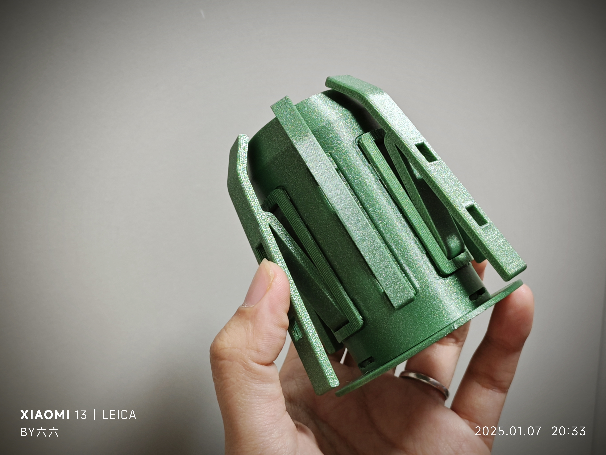
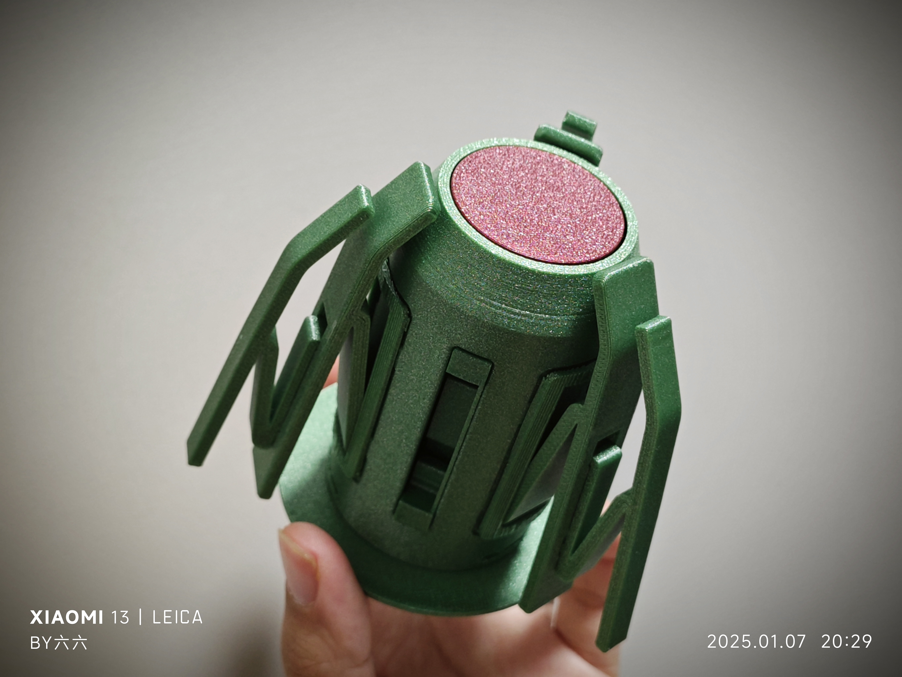

# AMSLite回转轴（带副爪系统）

这个项目提供了一个可打印的回转轴模型，该模型包含一个可选的副爪系统，适用于3D打印机。回转轴有助于保持打印过程中的线材张力，减少线材缠绕的可能性，从而降低打印失败的风险。
该模型外观与拓竹类似，除了爪部件外，模型的其他部件均可替换拓竹原版。

## 特点与优势

1. **易于打印 & 打印优化**: 该设计经过优化，拆件使得便于打印，减少了对支撑结构的需求，以及Z轴方向强度需要强化的部分做了拆件处理, 改变打印方向可以获得更好的强度。
2. **副爪系统**: 设计包括一个灵活的副爪系统，可根据不同的耗材轴心孔径进行适配，提高稳定性并减少缠线的风险。副爪可以从外壳上拆下并组装到主爪上，使得回转轴能够支持直径更大的料盘，尤其适用于孔径较大的料盘（例如Jayo,Sunlu品牌）。这种模块化系统确保了更高的稳定性，并最大限度地减少了缠线的可能性，适用于不同尺寸的耗材轴心。
3. **低成本**: 该设计非常具有成本效益，仅需92克耗材，硬件成本不到1元人民币，十分经济实惠。
4. **可替换部件**: 除了爪部件外，模型的其他部件均可替换原版，如果原版哪里损坏可用作为备件使用。

## 预览 - 带副爪的回转轴

这里是一些带副爪系统回转轴的预览，包括形态的变化的着色图，以及实拍

- **原本形态以及组合形态**
  
  

- **分体图**
  
  

- **实拍图**
  
  
  
  
  

## 动态展示

### 支持常规尺寸耗材盘中心孔  
回转轴的原本形态（副爪安装在外壳上），适用于大多数耗材品牌，例如 Bambu、Tinmorry 等。  

### 支持大尺寸耗材盘中心孔  
回转轴的组合形态（副爪安装在主爪上），适用于大尺寸中心孔耗材品牌，例如 Sunlu、Jayo 等。  

## 所需硬件

此模型需要两个硬件组件才能正常工作：

1. **三波形垫片**  
   - **尺寸**: 27mm x 34mm x 0.4mm  
   - **高度**: 3.1mm  
   - 

2. **扭簧**  
   - **线径**: 0.8mm  
   - **外径**: 9mm  
   - **旋转方向**: 180度左旋/右旋
   - **圈数**： 5
   - 

## 3MF 文件

为了简化打印过程，提供了3MF文件，您可以直接在 **Orca** 或 **Bambu Studio** 中使用：

- **all-in-one.3mf**: 3MF file for the ratory spool(include secondary claws), all in one plate, include both green and yellow core, you should uncheck one according to yourself.
- **amslite-rotary-spool-with-secondary-claws.3mf**: 包含回转轴（带副爪）的3MF文件， 部件分布在三盘, 第一盘包括底座，外壳，主爪座，主爪；第二盘包括中轴，轴盖，核心（黄色和绿色，选择其中一个），1.2mm的垫片；第三盘包括副爪爪座，副爪。
- **others**: 有五盘， 第一盘包括所有10个规格的垫片，第二盘包括扭簧弯曲模板（包括左右两个版本），第三盘是一体打印的主爪爪座，第四盘是一体打印的核心（包括黄色和绿色），第五盘是一体打印的中轴。

只需在 **Orca** 或 **Bambu Studio** 中打开这些3MF文件，即可开始打印！

## 组装说明

1. **主组件组装**：
   - 首先打印 **base.stl**、**shaft_cover.stl** 和 **shell_with_secondary-claws(thickened).stl** 文件。这些部件是回转轴的基础。
   - **推荐**：建议打印 **shell_with_secondary-claws(thickened).stl**，因为它包括了 **shell(thickened).stl** 的所有功能。如果您以后想要添加副爪系统，在此基础上，您只需添加副爪座和副爪。如果不需要副爪系统，只需使用 **shell_with_secondary-claws(thickened).stl** 即可，无需额外部件。

2. **爪部组件组装**：
   - **basic.stl** 适用于标准回转轴，不能与副爪系统配合使用，因为它没有副爪插槽。
   - 如果您计划使用副爪支撑更大直径的料盘，主爪应使用 **main_claw_with_secondary_slots.stl**，该主爪具有副爪插槽，可以与 **secondary_claw.stl** 配合使用。
   - **secondary_claw.stl** 只能与 **main_claw_with_secondary_slots.stl** 或 **secondary_claw_seat.stl** 配合使用，这些部件带有副爪插槽。
   - **推荐**：建议打印 **main_claw_with_secondary_slots.stl**，因为它包括了 **basic.stl** 的所有功能。如果以后需要副爪系统，只需在此基础上添加副爪，无需重新打印主爪。如果不需要副爪系统，只需使用 **main_claw_with_secondary_slots.stl** 即可，无需额外部件。

3. **爪座组装**：
   - 主爪座和副爪座分别使用 **main_claw_seat.stl** 和 **secondary_claw_seat.stl** 打印。

4. **核心部件**：
   - 如果您希望打印一体化的核心部件，请使用 **green_version.stl**（绿色版本）或 **yellow_version.stl**（黄色版本）。
   - 如果您希望将核心部件分开打印并使用胶水组装，请打印 **green_version_pieces/** 和 **common_pieces/**（绿色版本），或者 **yellow_version_pieces/** 和 **common_pieces/**（黄色版本）。分体打印的优势在于减少支撑材料和优化强度。
   - **common_pieces/** 文件夹包含两个版本核心部件都需要的共享部件，例如扭簧中心和短端卡扣。

5. **压力垫圈**：
   - 根据您的组装需求，从 **gaskets/** 中选择合适的垫圈厚度。

6. **中轴组件**：
   - 中轴组件有两种打印方式：
     - **一体化版本**：**shaft.stl** 是完整的中轴模型，作为单个部件打印。
     - **分体打印版本**：如果您希望将中轴分开打印并用胶水组装，请打印 **shaft_pieces/**

## 许可
本项目采用 [Creative Commons Attribution 4.0 International License](https://creativecommons.org/licenses/by/4.0/)，欢迎修改和分发，但请注明出处。

## 免责声明
请注意，回转轴和副爪系统设计并不适用于承受极高的负载或作为专业工具使用，仅适用于日常3D打印相关的线材管理。
