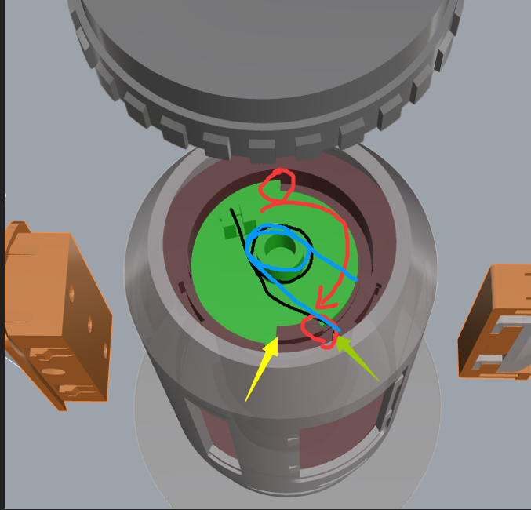

# How to Debug

## Debug Files
1. **Bambu Style**: [debug-bambu-style.3mf](../3mf/debug-bambu-style.3mf)
2. **Universal Version**: [debug-universal.3mf](../3mf/debug-universal.3mf)

## What Does Proper Pressure Look Like?
The rotary shaft should function as follows:
1. The core part rotates first.
2. Once the torsion spring reaches its limit and can no longer rotate, the outer shell starts to rotate.

Therefore, the three-wave gasket must provide sufficient friction. If the friction is too low, the outer shell will start rotating too early, reducing the overall rotation angle.

## How to Use Different Thickness Gaskets
The `debug-bambu-style.3mf` and `debug-universal.3mf` files include a perforated cover and four gasket thickness options:
- **0.2mm**
- **0.4mm**
- **0.8mm**
- **1.6mm**

By combining these gaskets, the following thicknesses can be achieved:

| Combination | Thickness (mm) |
|------------|--------------|
| 0.2        | 0.2          |
| 0.4        | 0.4          |
| 0.2 + 0.4  | 0.6          |
| 0.8        | 0.8          |
| 0.2 + 0.8  | 1.0          |
| 0.4 + 0.8  | 1.2          |
| 0.2 + 0.4 + 0.8 | 1.4     |
| 1.6        | 1.6          |
| 0.2 + 1.6  | 1.8          |
| 0.4 + 1.6  | 2.0          |
| 0.2 + 0.4 + 1.6 | 2.2     |
| 0.8 + 1.6  | 2.4          |
| 0.2 + 0.8 + 1.6 | 2.6     |
| 0.4 + 0.8 + 1.6 | 2.8     |
| 0.2 + 0.4 + 0.8 + 1.6 | 3.0 |

## How to Determine the Right Gasket Thickness Using the Perforated Cover
The provided perforated cover model allows you to observe the torsion spring’s movement through the opening, helping to select the correct gasket thickness.

### Selection Method:
1. Start with a thinner gasket.
2. Observe the core rotation:
   - **If the outer shell starts rotating before the core reaches its limit**, the gasket thickness is insufficient, and you need to increase it.
   - **If the outer shell starts rotating only after the core reaches its limit**, the balance is correct.
   - Below image provide you a sample of the position:
      - 
      - The image uses a green core as an example.
      - Black represents the initial torsion spring position.
      - Red indicates the core’s rotation direction.
      - Blue marks the torsion spring’s final position.
3. Gradually increase the gasket thickness until you find the optimal balance.

**Example:**
- You first test with a **1.2mm** combination and notice that the outer shell starts rotating before the core fully reaches its limit.
- Then, you try **1.4mm**, but the issue persists.
- Increasing to **1.6mm**, you see that the core reaches its limit before the outer shell rotates, indicating that **1.6mm is the correct thickness**.

By following this process, you can fine-tune the gasket thickness to ensure the rotary shaft functions properly.
