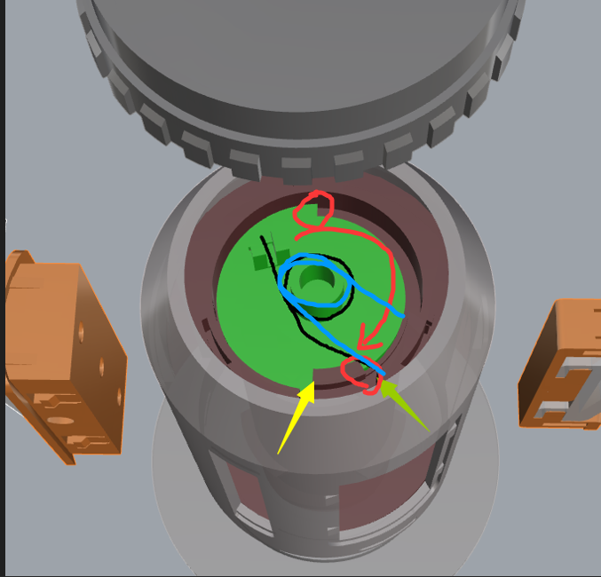

# 如何 Debug

## Debug 文件
1. **Bambu Style**：[debug-bambu-style.3mf](../3mf/debug-bambu-style.3mf)
2. **Universal Version**：[debug-universal.3mf](../3mf/debug-universal.3mf)

## 什么样子是压力合适？
回转轴正常的工作情况是：
1. 先旋转核心部分。
2. 扭簧转到位，无法继续旋转后，外壳才开始旋转。

因此，三波峰垫片需要提供足够的摩擦力。如果摩擦力不足，外壳会提前旋转，导致回转角度变小。

## 如何使用不同厚度的垫片
在 `debug-bambu-style.3mf` 和 `debug-universal.3mf` 文件中，包含了一个镂空盖子和四种厚度的垫片：
- **0.2mm**
- **0.4mm**
- **0.8mm**
- **1.6mm**

通过组合这些垫片，可以实现以下厚度：

| 组合方式  | 厚度 (mm) |
|----------|---------|
| 0.2      | 0.2     |
| 0.4      | 0.4     |
| 0.2 + 0.4 | 0.6     |
| 0.8      | 0.8     |
| 0.2 + 0.8 | 1.0     |
| 0.4 + 0.8 | 1.2     |
| 0.2 + 0.4 + 0.8 | 1.4 |
| 1.6      | 1.6     |
| 0.2 + 1.6 | 1.8     |
| 0.4 + 1.6 | 2.0     |
| 0.2 + 0.4 + 1.6 | 2.2 |
| 0.8 + 1.6 | 2.4     |
| 0.2 + 0.8 + 1.6 | 2.6 |
| 0.4 + 0.8 + 1.6 | 2.8 |
| 0.2 + 0.4 + 0.8 + 1.6 | 3.0 |

## 如何利用镂空盖子确定合适的垫片厚度
项目提供的镂空盖子模型，可以通过观察镂空缝隙内的扭簧旋转情况，帮助选择合适的垫片厚度。

### 选择方法：
1. 先从较薄的垫片组合开始测试。
2. 观察核心旋转情况：
   - **如果核心尚未转到头，外壳就开始旋转**，说明垫片厚度不足，需要增加厚度。
   - **如果核心转到位后，外壳才开始旋转**，说明达到了合适的平衡。
   - 这张图片提供了位置的示例
     - 
     - 以绿色核心为示例
     - 黑色表示初始扭簧位置
     - 红色表示核心旋转方向
     - 蓝色表示扭簧最终位置
3. 逐步增加垫片厚度，直到找到最佳平衡点。

**示例：**
- 你先尝试 **1.2mm** 组合，发现核心未完全转到头时外壳就开始旋转。
- 然后尝试 **1.4mm**，问题仍然存在。
- 继续增加到 **1.6mm**，发现核心先到位后，外壳才旋转，说明 **1.6mm 是合适的厚度**。

通过这个方法，你可以精确调整垫片厚度，确保回转轴正常工作。