# AMS Lite Rotary Spool Design Document

This document provides a detailed overview of the design process for the AMS Lite Rotary Spool, including the creation and assembly steps of each component to ensure optimal functionality and performance.

## Table of Contents

- [Introduction](#Introduction)
- [Design Process](#Design-Process)
- [Design Challenges and Solutions](#Design-Challenges-and-Solutions)
- [Conclusion](#Conclusion)

## Introduction

The AMS Lite Rotary Spool is a versatile spool designed to meet the needs of 3D printing applications. It supports various types and sizes of filaments while ensuring ease of printing and low production cost.

## Design Process

The design of the Rotary Spool focuses on the precise matching and fitting of each part, ensuring that all components are easy to print, have good strength, and can support filaments of different diameters.

### 1. **Core Components (Green and Yellow Versions)**

*The core components are derived from measurements of the original version and can serve as replacements for the original spool parts*. The core is the central part of the rotary spool, and the design considers the direction of rotation. The green and yellow versions provide different options to meet the user's needs for different filament feeding directions.

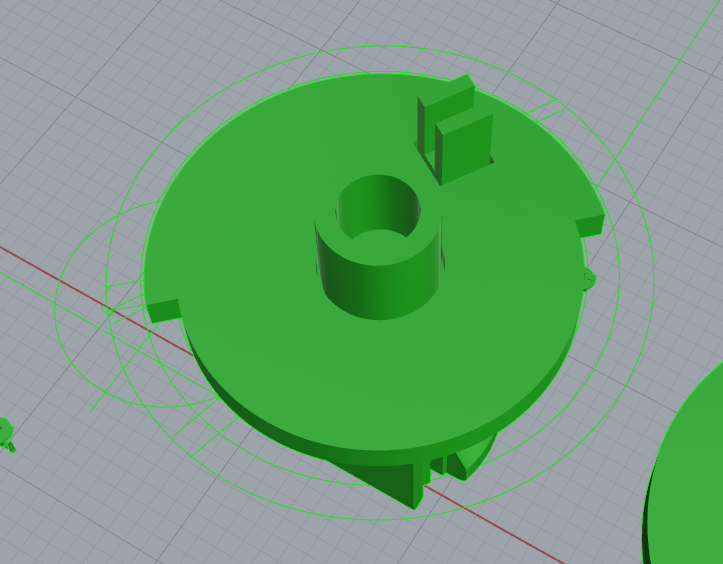
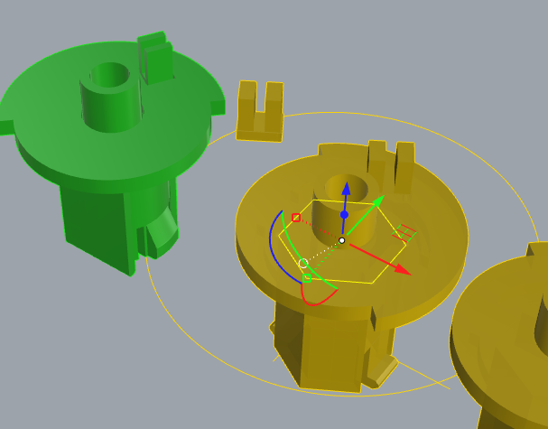

To enhance the strength along the Z-axis and facilitate printing, the core components are designed in separate pieces.

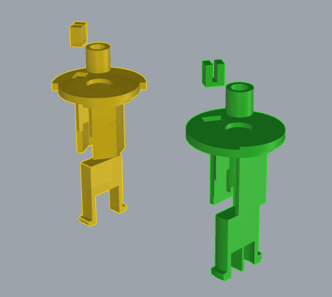

### 2. **Shaft Design**

*The shaft is based on measurements of the original version and can serve as a replacement part*. The shaft connects the core to the base and outer shell, ensuring smooth rotation.

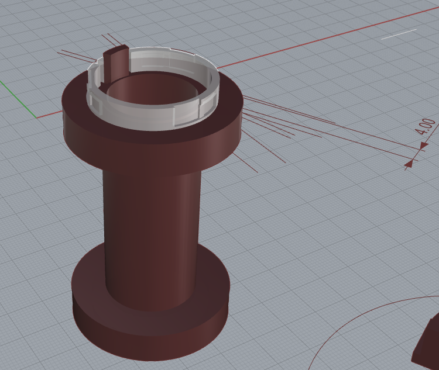

To address the Z-axis strength issue and improve printing convenience, the shaft is also split into multiple pieces.

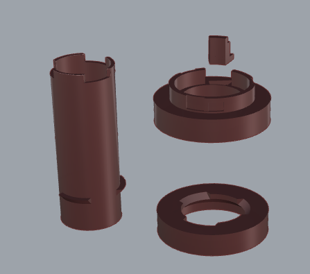

### 3. **Shaft Cover Design**

*The shaft cover is derived from measurements of the original version and can serve as a replacement part*.

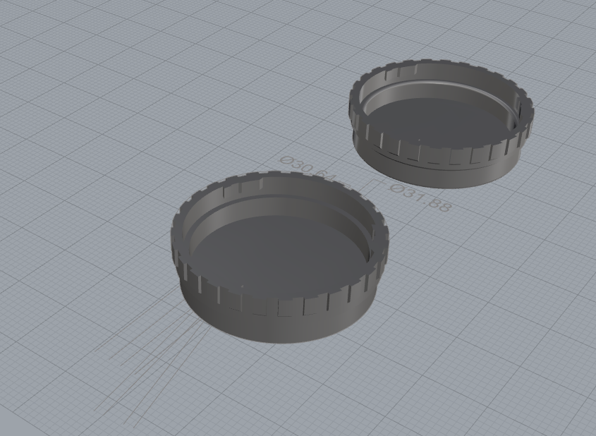

### 4. **Base Design**

*The base is based on measurements of the original version and can serve as a replacement part*. Since the original metal spring clips do not have a universal solution, we have used three-wave gaskets. As a result, the base model differs slightly from the original version. To achieve the correct friction, different gasket thicknesses are provided for the user's adjustment.

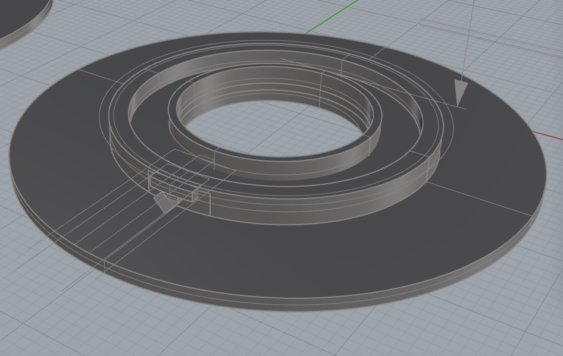

If the suitable pressure is uncertain, users can print and test different gasket thicknesses. For example, printing 0.2mm, 0.4mm, and 0.8mm gaskets will allow combinations that result in seven different thicknesses (0.2mm, 0.4mm, 0.6mm, 0.8mm, 1.0mm, 1.2mm, 1.4mm).

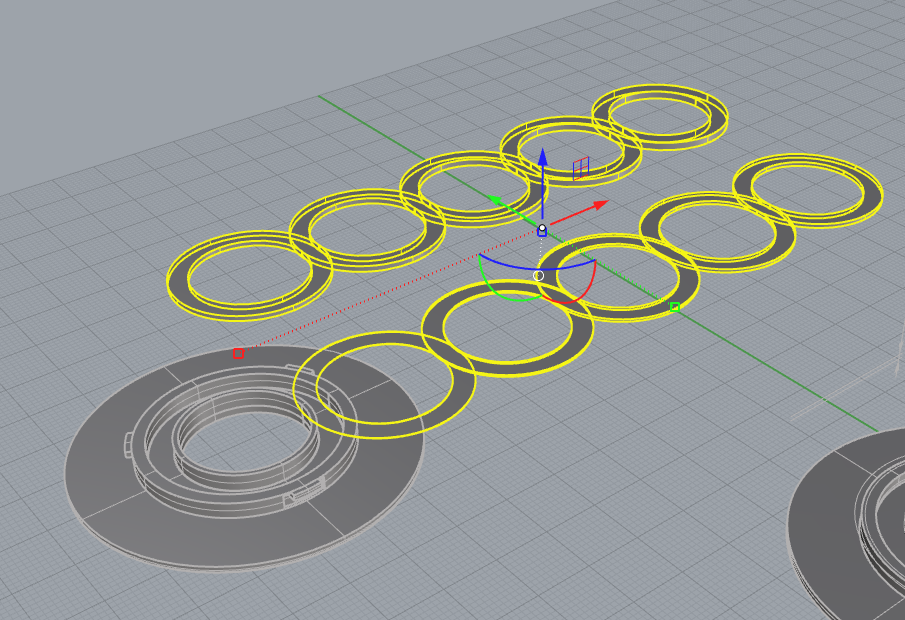

### 5. **Main Claw Seat Design**

*The main claw seat is derived from measurements of the original version and can serve as a replacement part*. The original version uses C-type spring clips, but there is no universal solution, so we adopted a Z-spring design for the claws. To ensure a secure connection between the claw and the claw seat, M1.6 threaded holes for screws have been added.

To enhance the strength along the Z-axis, the claw seat panel has been thickened, and the clip portions have been split into separate pieces for improved strength.

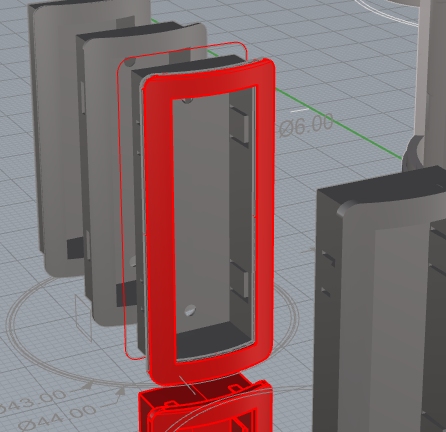
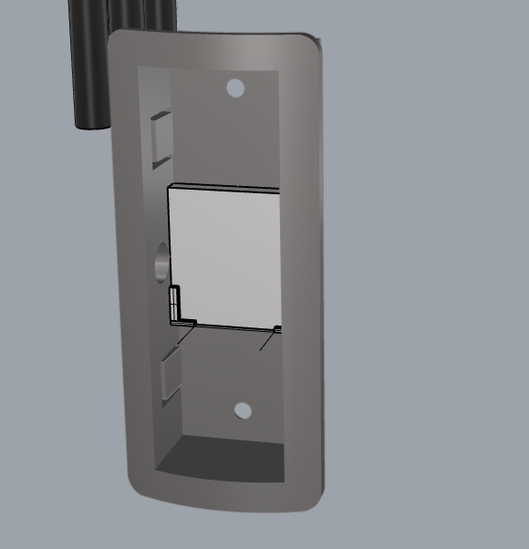
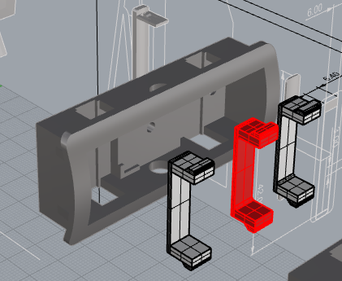

### 6. **Main Claw Design**

The main claw’s shape was derived from measurements of the original version, ensuring the upper part rests on the edge of the outer shell, with the lower part’s distance from the shell being verified through measurements. The original version caused the tail end of the claw to rub against the base, so the model's tail end length was reduced accordingly.

To achieve similar deformation properties as the original version, a Z-spring structure was used, with the connection point located along a circular rotational path that aligns with the inner edge of the claw seat.

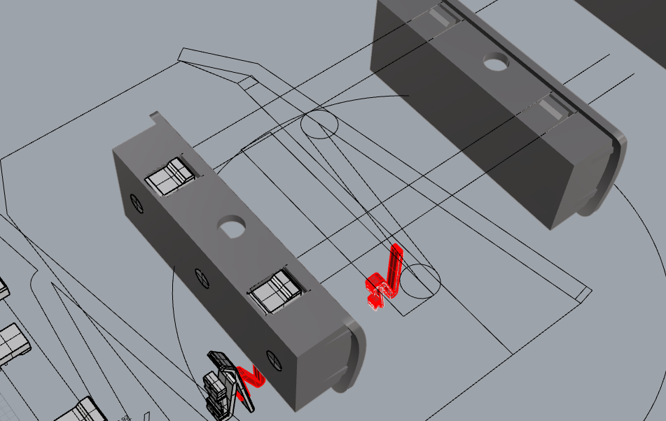

Additionally, to support the secondary claw system, two square slots were added to the main claw based on the principle of hole boards.

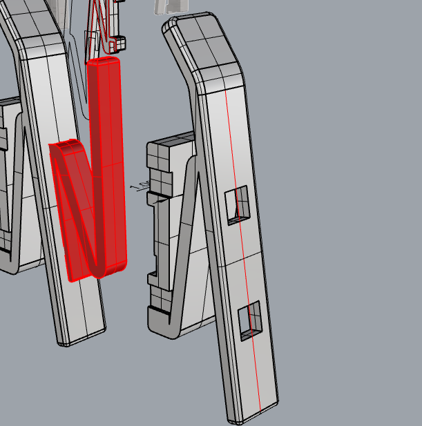

### 7. **Secondary Claw and Secondary Claw Seat Design**

The secondary claw is designed to support larger diameter filament spools, requiring quick disassembly and supporting two configurations. The secondary claw uses a Z-spring structure, and its connection point is similar to the main claw, aligned with the inner edge of the claw seat through a rotational path.

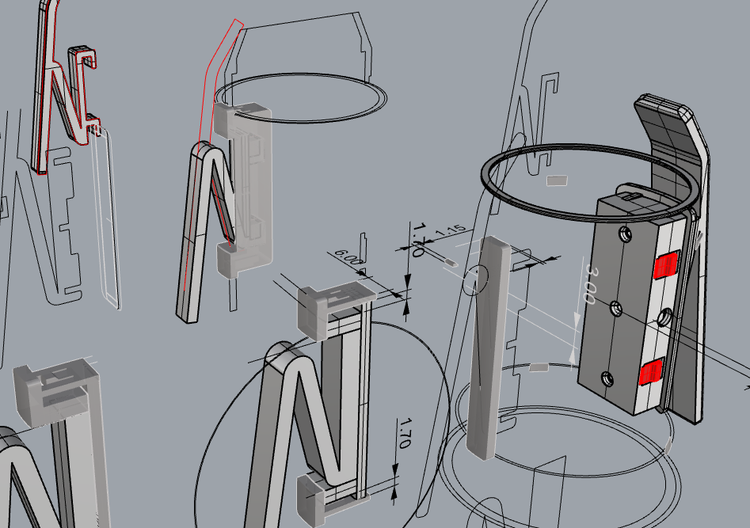

The secondary claw seat design follows the principle of hole boards, using a hook-and-snap design for quick disassembly. To enhance the strength of the connection between the secondary claw seat and the outer shell, a supporting backplate was added to address instability caused by deformation.

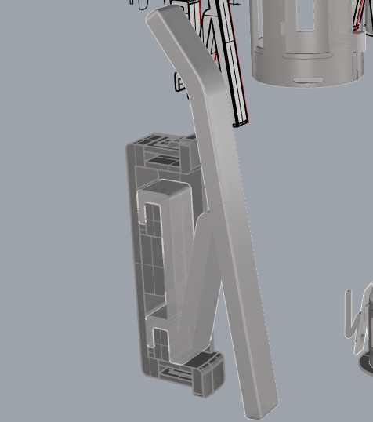

## Design Challenges and Solutions

### Challenge 1: Ensuring Print Strength
Due to the nature of 3D printing, the strength along the Z-axis is significantly lower than along the XY axes. To ensure the rotary spool has high strength, we used part disassembly and optimized the print direction to improve Z-axis strength.

### Challenge 2: Supporting Filaments of Different Sizes
To accommodate different filament diameters, we designed the secondary claw system. The secondary claw can be printed as needed and, when in use, can be quickly detached from the outer shell and reassembled onto the main claw to ensure the rotary spool can adapt to different filament sizes.

## Conclusion

The design goal of the AMS Lite Rotary Spool is to make it easy for users to print, support multiple filament sizes, and deliver excellent performance. By optimizing the design and material selection, we created a cost-effective and durable rotary spool system that meets the needs of most 3D printing applications.

---

For any questions or feedback, please feel free to ask in the [Issue](https://github.com/zjoycelee/amslite-rotary-spool/issues).
