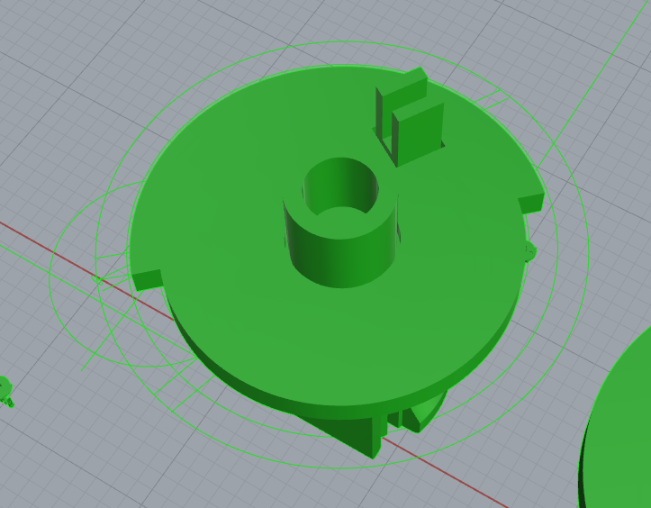
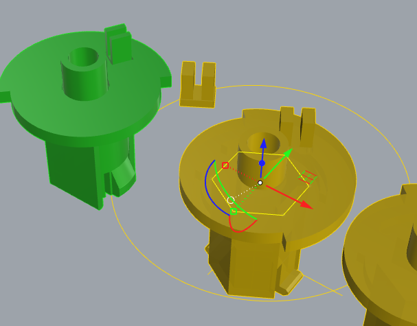
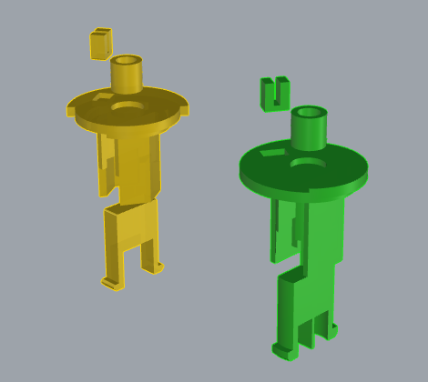
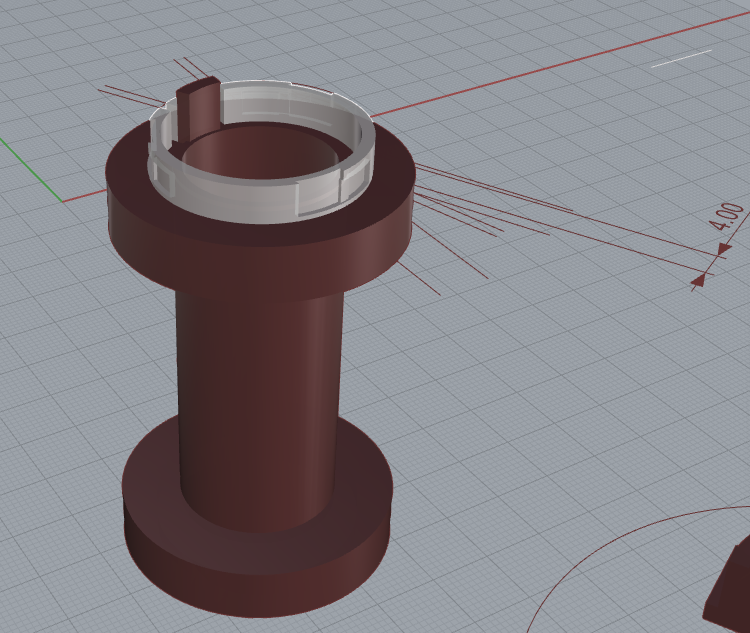
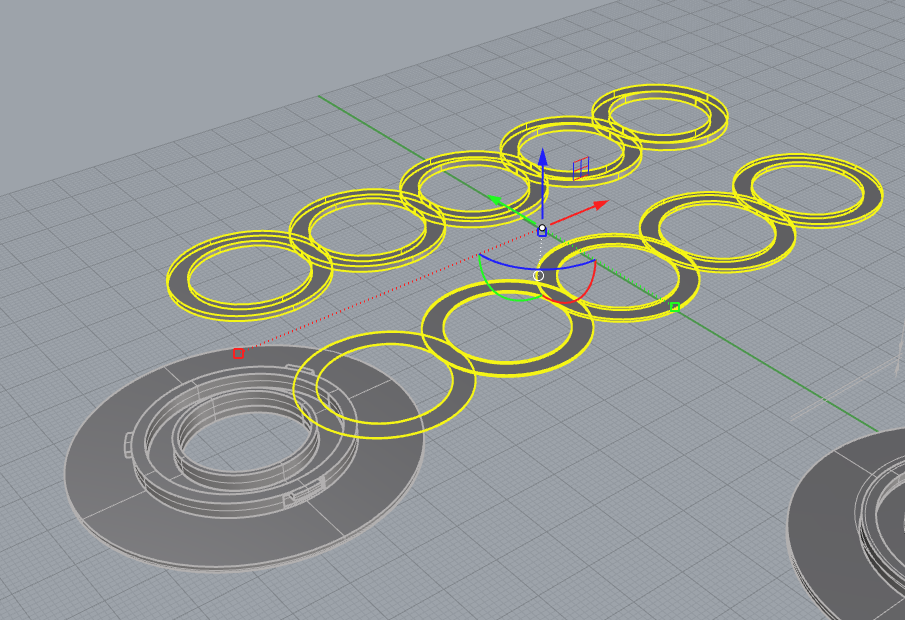
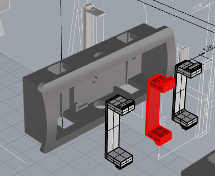
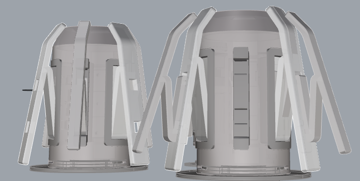

# AMS Lite 回转轴设计文档

本文档详细介绍了AMS Lite回转轴的设计过程，包括每个部件的创作和组装步骤，以确保最佳的功能性和性能。

## 目录

- [简介](#简介)
- [设计过程](#设计过程)
- [设计挑战与解决方案](#设计挑战与解决方案)
- [总结](#总结)

## 简介

AMS Lite回转轴是为了满足3D打印应用需求而设计的多功能回转轴。它支持多种类型和规格的耗材，同时确保易于打印，并具备较低的生产成本。

## 设计过程

该回转轴的设计注重每个部件的精准匹配和配合，确保所有零件易于打印且可以保持较好的强度，并能支持不同直径的耗材。

### 1. **核心部件（绿色与黄色版本）**
*通过测绘原版获得，可用作原版替换件*，核心部件是回转轴的核心，设计时考虑了旋转方向。绿色和黄色版本提供了不同选择，满足用户不同进料方向的需求。

为了增强Z轴方向的强度并便于打印，核心部分进行了拆件设计。

### 2. **中轴设计**
*通过测绘原版获得，可用作原版替换件*，中轴连接核心与底座、外壳，确保旋转的流畅性。

考虑到Z轴方向的强度问题，并为了方便打印，中轴部分也进行了拆件设计。

### 3. **轴盖设计**
*通过测绘原版获得，可用作原版替换件*。

### 4. **底座设计**
*通过测绘原版获得，可用作原版替换件*。由于原版金属弹片没有通用方案，我们使用了三波峰垫片。因此，底座模型与原版有些许不同。为了获得合适的摩擦力，提供了不同厚度的垫片，方便用户调节。

如果不确定合适的压力，可以打印不同厚度的垫片进行组合测试。例如，可以打印0.2、0.4、0.8mm三个厚度的垫片，并通过组合测试，获得7种不同的厚度(0.2mm, 0.4mm, 0.6mm, 0.8mm, 1.0mm, 1.2mm, 1.4mm)。

### 5. **主爪座设计**
*通过测绘原版获得，可用作原版替换件*，由于原版爪子使用C型弹片，但没有通用方案，因此采用了Z字形弹簧结构的爪。为了确保爪与爪座的稳固连接，增加了M1.6沉孔螺丝的孔洞。

为了增加Z轴方向的强度，爪座的面板进行了加厚，并且对卡扣部分进行了拆件设计。

### 6. **主爪设计**
主爪的外形是通过测绘原版获得的，确保上端能够搭在外壳边缘，下端距离外壳的长度也已通过测量确认。原版按压时，尾端会擦到底座，因此对模型尾端长度做了一定缩减。

为了让主爪具有类似原版的形变能力，采用了Z字形弹簧结构，连接位置通过旋转的圆形路径与爪座的内边缘进行配合。

此外，为了支持副爪系统，参考了洞洞板的原理，在主爪上增加了两个方形槽位。

### 7. **副爪与副爪座设计**
副爪设计用于支持更大直径的耗材卷，要求能够快速拆卸并支持两种形态。副爪采用Z字形弹簧结构，与主爪的连接位置类似，通过旋转的路径与爪座的内边缘对接。

副爪座的设计借鉴了洞洞板原理，挂钩式卡扣设计使得副爪能够快速拆卸。为了增强副爪座与外壳的连接强度，副爪座的背面增加了支撑板，以解决形变引起的连接不稳固问题。

## 设计挑战与解决方案

### 挑战 1：确保打印强度
由于3D打印特性，Z轴方向的承受力远低于XY方向。为了确保回转轴具备高强度，我们通过拆件设计并优化打印方向，从而提升了Z轴方向的强度。

### 挑战 2：支持不同规格的耗材
为了解决支持不同直径耗材的问题，我们设计了副爪系统。副爪可以根据需求进行打印，并在使用时根据耗材的直径从外壳上快速拆卸并装配到主爪上，确保回转轴能够适应不同尺寸的耗材。

## 总结

AMS Lite回转轴的设计目标是便于用户打印、支持多种规格的耗材，并提供优异的性能。通过优化设计和材料选择，创造了一个成本、耐用的回转轴系统，能够满足大多数3D打印应用的需求。

---

如有任何问题或反馈，欢迎在[Issue](https://github.com/zjoycelee/amslite-rotary-spool/issues)中提问。
