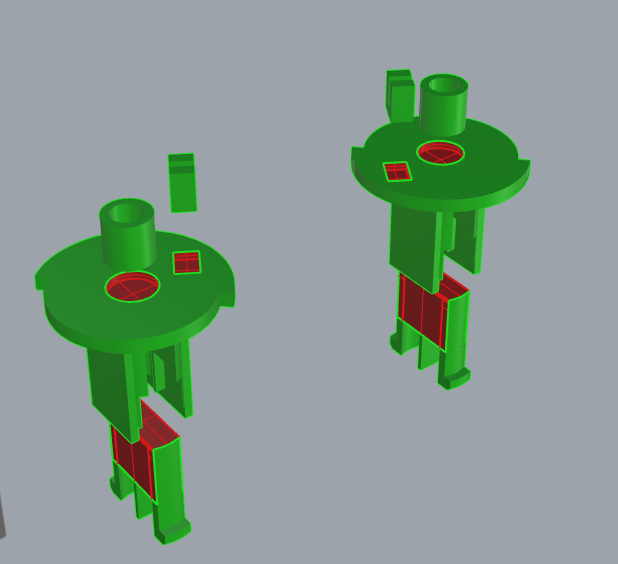
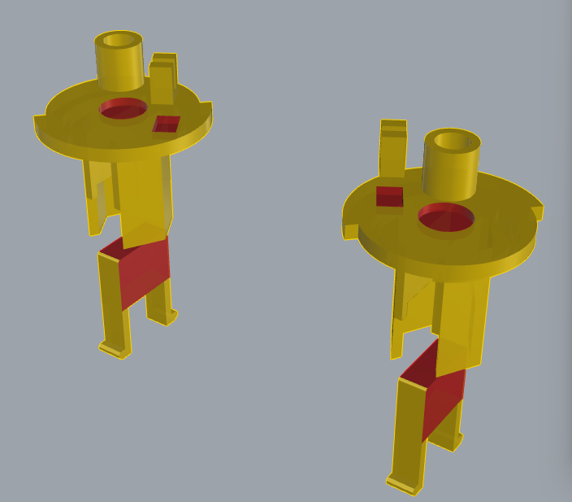
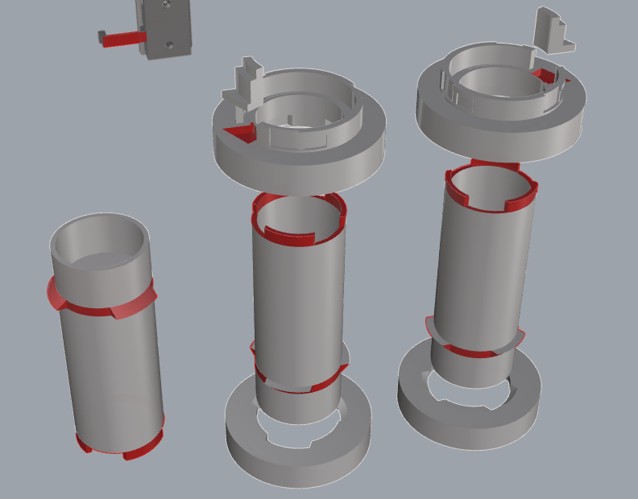

# 涂抹胶水位置指南

在分件打印并进行组装时，某些部位需要涂抹胶水以确保牢固的粘合。以下是不同部件的涂胶位置指南，请根据图片中标出的红色区域进行胶水涂抹。

## 1. 卡爪座（Claw Seat）

- **底座与卡扣部分：** 卡爪座的底座和卡扣接触面需要涂抹胶水，确保这两个部分牢固结合。

## 2. 绿色核心（Green Core）

- **卡扣部分：** 在绿色核心的卡扣部分涂抹胶水，确保卡扣牢固地固定。
- **扭簧中心固定：** 扭簧中心部分和核心接触的部分需要涂抹胶水，确保扭簧稳固固定。
- **扭簧短边固定：** 扭簧短边和核心接触的部分需要涂抹胶水，以确保扭簧正确固定。

## 3. 黄色核心（Yellow Core）

- **卡扣部分：** 在黄色核心的卡扣部分涂抹胶水，确保卡扣牢固地固定。
- **扭簧中心固定：** 扭簧中心部分和核心接触的部分需要涂抹胶水，以确保扭簧稳固固定。
- **扭簧短边固定：** 扭簧短边和核心接触的部分需要涂抹胶水，确保扭簧正确固定。

## 4. 中轴（Shaft）

- **圆杆部分：** 在中轴的圆杆与其他连接部分接触的位置涂抹胶水。
- **上圆饼与扭簧长边固定：** 上圆饼与扭簧长边接触的部分需要涂抹胶水，确保扭簧长边牢固固定。

## 组装步骤

1. **选择胶水**：使用适合塑料或3D打印部件的强力胶水。
2. **涂抹胶水**：按照上述图片中的红色标记区域，在部件接触面均匀涂抹胶水。
3. **组合部件**：将涂有胶水的部件快速对准并固定。确保每个部件都紧密贴合，没有间隙。
4. **等待胶水固化**：按胶水说明书上的固化时间，确保部件牢固连接。

## 注意事项

- 请确保在涂抹胶水时避免过量，以免胶水溢出影响部件外观或导致连接不牢固。
- 选择快速固化的胶水，可以减少等待时间，提高组装效率。
- 在进行任何组装操作前，请确保所有部件都已经完全冷却，确保胶水能够正确固化。
- 请在通风良好的环境中操作，确保胶水挥发气体不会影响健康。
- 使用胶水时请戴上防护手套，避免直接接触胶水，避免过敏或皮肤不适。
- 在胶水涂抹和部件组装过程中，建议使用垫板或废纸保护桌面，以免胶水溅洒到不该粘连的地方，避免粘连不必要的部件或桌面。
