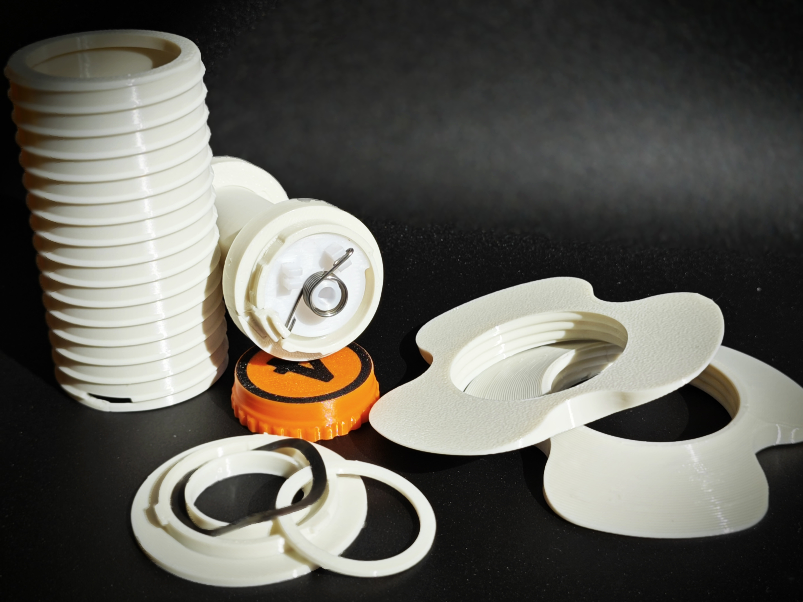
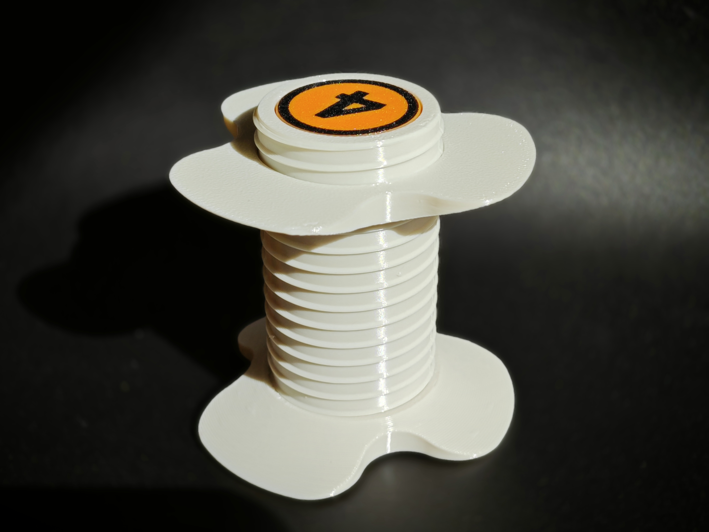
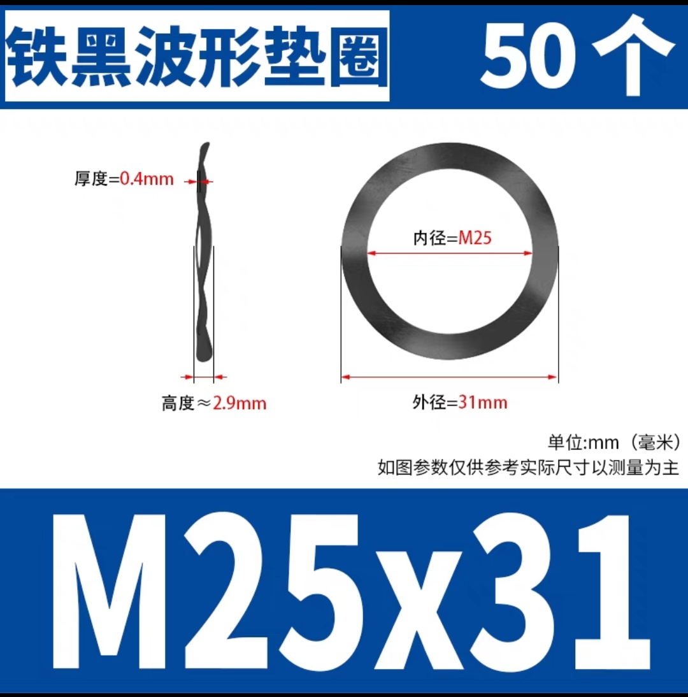

# AMSLite 通用回转轴

本项目提供了一个适用于3D打印机的回转轴模型。回转轴能够在打印过程中保持线材的张力，减少线材缠绕的可能性，从而降低打印失败的风险。此模型与拓竹原版回转轴相同的核心，并可使用 AMSLite 固定轴（18mm 直径）。

## 特点与优势

1. **易于打印 & 打印优化**  
   该设计经过优化，拆件使得便于打印，减少了对支撑结构的需求，同时强化了 Z 轴方向的强度。改变打印方向可以获得更好的强度。

2. **料盘适用广**  
   螺杆部分直径为 40.69mm，螺母部分最大直径为 80mm，螺杆长度为 75mm，适配绝大多数 200g、250g 和 1kg 的料盘。

3. **低成本**  
   该设计非常具有成本效益，仅需 60 克耗材，硬件成本不到 1 元人民币，经济实惠。

4. **打印速度快**  
   完成打印时间仅需约 2 小时。

5. **原版固定轴可用**  
   核心部分提供黄色和绿色两个版本，内径与原版一致，模型高度与原版相同，因此原版固定轴可与此模型兼容。

## 预览 - 通用回转轴

- **着色图预览**  
  

- **分体图**  
  

- **实拍图**  
  
  
  
  

## 动态展示

## 所需硬件

此模型需要以下两个硬件组件才能正常工作：

1. **三波形垫片**  
   - **尺寸**: 25mm x 31mm x 0.4mm  
   - **高度**: 2.9mm  
   - 

2. **扭簧**  
   - **线径**: 0.8mm  
   - **外径**: 9mm  
   - **旋转方向**: 180° 左旋/右旋  
   - **圈数**: 5  
   - 

## 3MF 文件

为简化打印过程，提供了3MF文件，您可以直接在 **Orca** 或 **Bambu Studio** 中使用：

- **universal-amslite-rotary-spool-holder-with-auto-rewind**: 包含通用回转轴的3MF文件，涵盖所有所需模型文件：底座、外壳、中轴、轴盖、核心（黄色和绿色，选择其一）、1.2mm 垫片、料盘螺母。
- **universal-others**: 包括四盘文件：
  1. 第一盘：所有 10 种规格的垫片。
  2. 第二盘：扭簧弯曲模板（左右版本）。
  3. 第三盘：一体打印的核心（包括黄色和绿色版本）。
  4. 第四盘：一体打印的中轴。

在 **Orca** 或 **Bambu Studio** 中打开这些3MF文件，即可开始打印！

## 组装说明

1. **主组件组装**  
   打印以下文件：**base_d46.stl**、**shaft_cover.stl** 和 **shell_with_support.stl**/**shell.stl**。这些是回转轴的基础部件。  
   **推荐**：建议打印 **shell_with_support.stl**，该模型在悬空孔洞部位增加了支撑，打印完成后可手动去除，能够获得更好的锁定孔。

2. **核心部件**  
   - 若希望打印一体化的核心部件，使用 **green_version.stl**（绿色版本）或 **yellow_version.stl**（黄色版本）。
   - 若希望将核心部件分开打印并用胶水组装，请打印 **green_version_pieces/** 和 **common_pieces/**（绿色版本），或 **yellow_version_pieces/** 和 **common_pieces/**（黄色版本）。分体打印有助于减少支撑材料并优化强度。
   - **common_pieces/** 文件夹包含核心部件所需的共享部件，例如扭簧中心和短端卡扣。

3. **压力垫圈**  
   根据您的组装需求，从 **gaskets/** 文件夹中选择适合的垫圈厚度。

4. **中轴组件**  
   - **一体化版本**：使用 **shaft.stl** 打印完整中轴模型作为单一部件。
   - **分体打印版本**：若希望将中轴分开打印并用胶水组装，请打印 **shaft_pieces/**。

## 许可

本项目采用 [Creative Commons Attribution 4.0 International License](https://creativecommons.org/licenses/by/4.0/)，欢迎修改和分发，但请注明出处。

## 免责声明

请注意，回转轴和副爪系统设计并不适用于承受极高负载或作为专业工具使用，仅适用于日常 3D 打印相关的线材管理。
