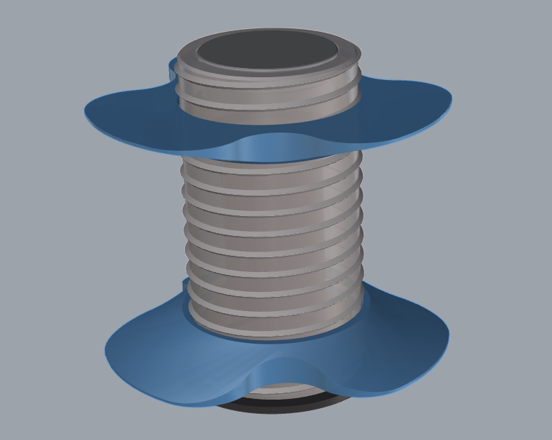
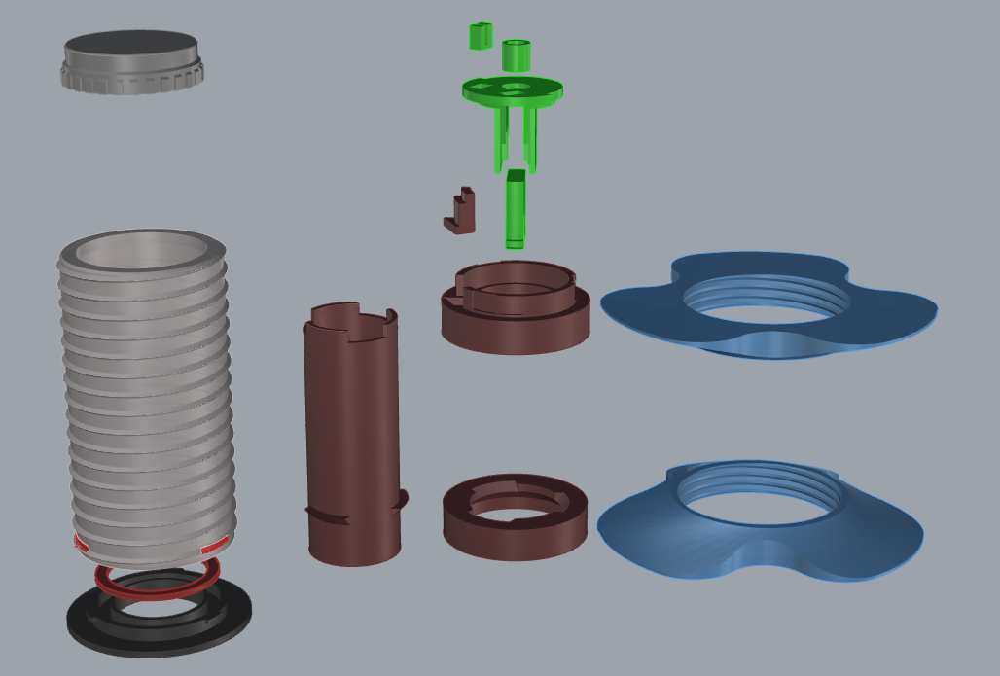
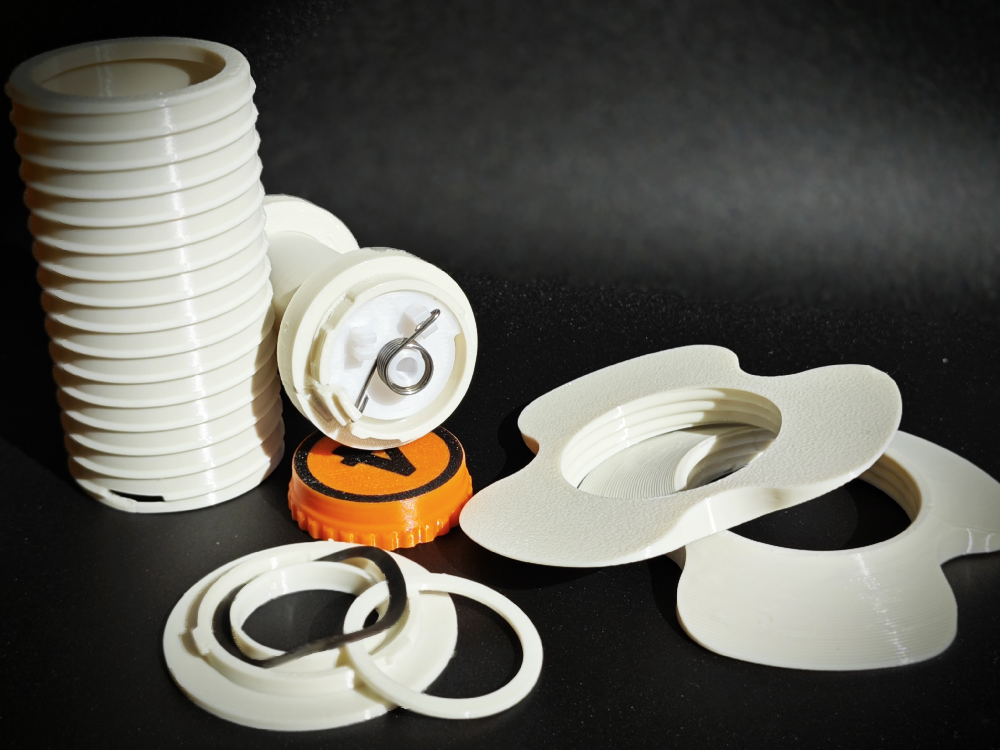
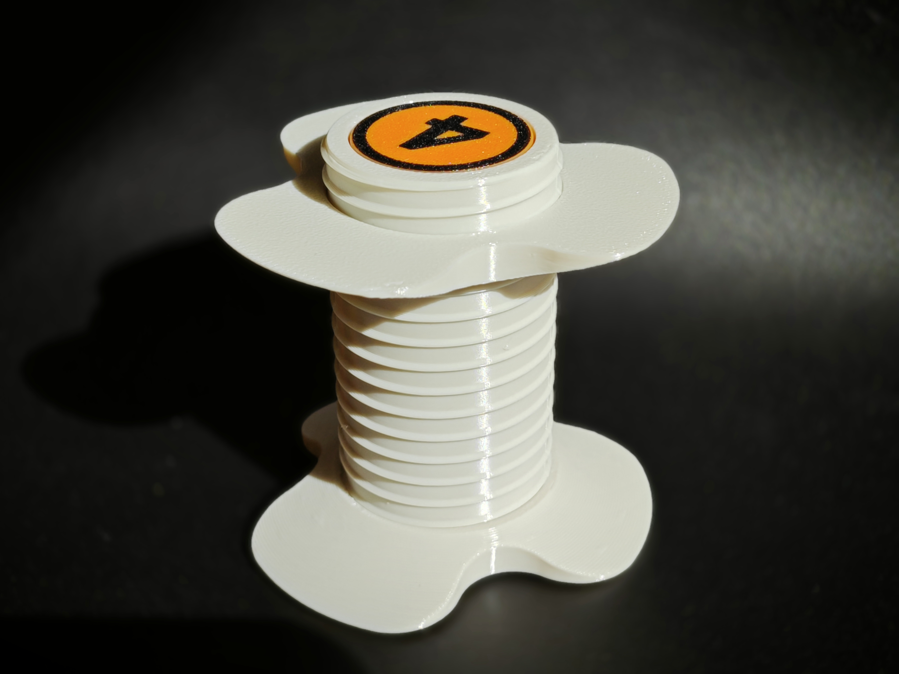
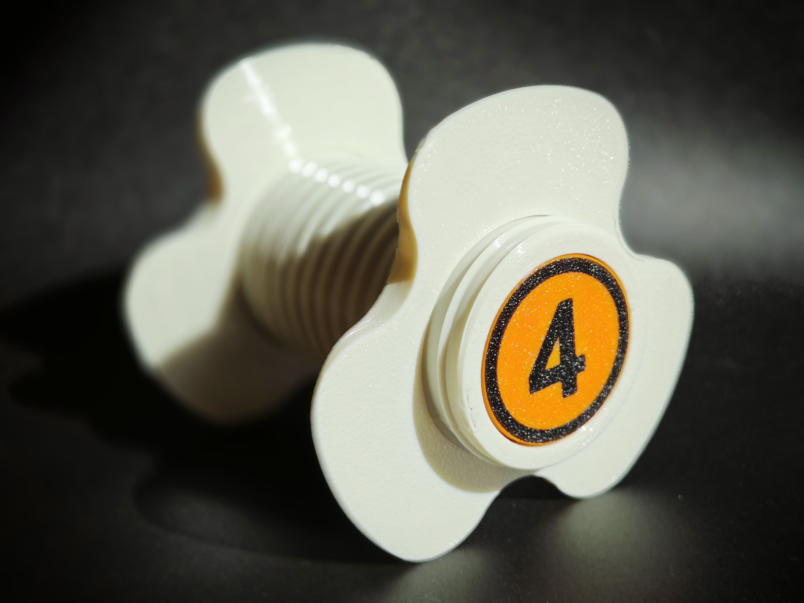
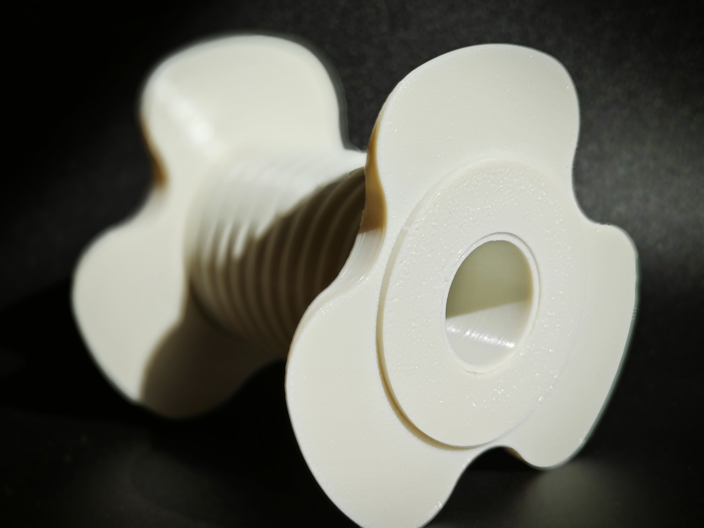

# AMSLite Universal Rotary Spool Holder

This project provides a printable rotary spool holder model for 3D printers. The rotary spool holder helps maintain tension on the filament during printing, reducing the chance of tangling and thereby lowering the risk of print failures. The model is compatible with the AMSLite fixed axle (18mm diameter) and uses the same core as the original Bambu design.

## Features & Advantages

1. **Easy to Print & Print Optimized**  
   This design is optimized for easy printing, reducing the need for support structures. It also enhances the Z-axis strength by splitting parts, and changing the print orientation provides better strength.

2. **Wide Spool Compatibility**  
   The screw section has a minimal diameter of 40.69mm, and the nut section can accommodate spools up to 80mm in diameter. The screw length is 75mm, making it compatible with most 200g, 250g, and 1kg filament spools.

3. **Low Cost**  
   This design is cost-effective, requiring only 59g of filament, with hardware costs under 1 RMB, making it very affordable.

4. **Fast Print Time**  
   The print time is approximately 2.5 hours.

5. **Compatible with Original Fixed Axle**  
   The core part comes in yellow and green versions, and the inner diameter of the shaft is the same as the original. The model height matches the original, so any fixed axle used with the original design will work with this model and can be installed on the AMSLite.

## Preview - Universal Rotary Spool Holder

- **Shaded View Preview**  
  

- **Exploded View**  
  

- **Real Shots**  
  
  
  
  

## Dynamic Preview

## Required Hardware

This model requires the following hardware components to function properly:

1. **Three-Wave Gasket**  
   - **Size**: 25mm x 31mm x 0.4mm  
   - **Height**: 2.9mm  
   - 

2. **Torsion Spring**  
   - **Wire Diameter**: 0.8mm  
   - **Outer Diameter**: 9mm  
   - **Rotation Direction**: 180° Left/Right Rotation  
   - **Turns**: 5  
   - 

## 3MF Files

To simplify the printing process, 3MF files are provided. You can directly use them in **Orca** or **Bambu Studio**:

- **universal-amslite-rotary-spool-holder-with-auto-rewind**: Contains the 3MF file for the universal rotary spool holder, including all required models: base, shell, shaft, shaft cover, core (yellow and green, choose one), 1.2mm gasket, and spool nut.
- **universal-others**: Includes four disks:
  1. The first disk contains all 10 different gasket specifications.
  2. The second disk contains the torsion spring bending template (left and right versions).
  3. The third disk contains the integrated core (yellow and green versions).
  4. The fourth disk contains the integrated shaft.

Simply open these 3MF files in **Orca** or **Bambu Studio** to start printing!

## Assembly Instructions

1. **Assembling the Main Components**  
   Print the following files: **base_d46.stl**, **shaft_cover.stl**, and **shell_with_support.stl**/**shell.stl**. These are the base components of the rotary spool holder.  
   **Recommended**: Print **shell_with_support.stl**, as this model adds supports to the holes in the suspension areas, which can be manually removed after printing for better locking holes.

2. **Core Components**  
   - If you wish to print the core as a single part, use **green_version.stl** (green version) or **yellow_version.stl** (yellow version).
   - If you want to print the core components separately and assemble them with glue, print **green_version_pieces/** and **common_pieces/** (green version), or **yellow_version_pieces/** and **common_pieces/** (yellow version). Separately printed parts help reduce support material and optimize strength.
   - The **common_pieces/** folder contains shared parts required for both versions of the core, such as the torsion spring center and short end clips.

3. **Gaskets**  
   Choose the appropriate gasket thickness from the **gaskets/** folder based on your assembly needs.

4. **Shaft Assembly**  
   - **Integrated Version**: Use **shaft.stl** to print the complete shaft model as a single part.
   - **Separate Printing Version**: If you wish to print the shaft separately and assemble it with glue, print **shaft_pieces/**.

## License

This project is licensed under the [Creative Commons Attribution 4.0 International License](https://creativecommons.org/licenses/by/4.0/), which allows for modification and distribution with proper attribution.

## Disclaimer

Please note that the rotary spool holder and secondary claw system are not designed for high load-bearing or professional tool use. They are intended for general 3D printing filament management only.
