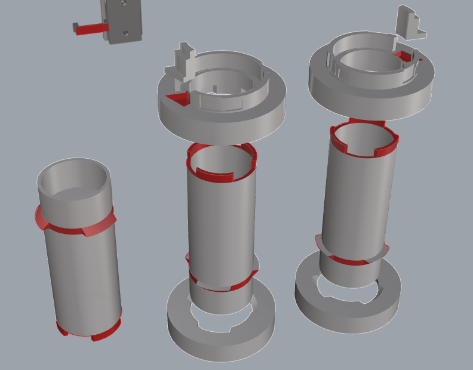
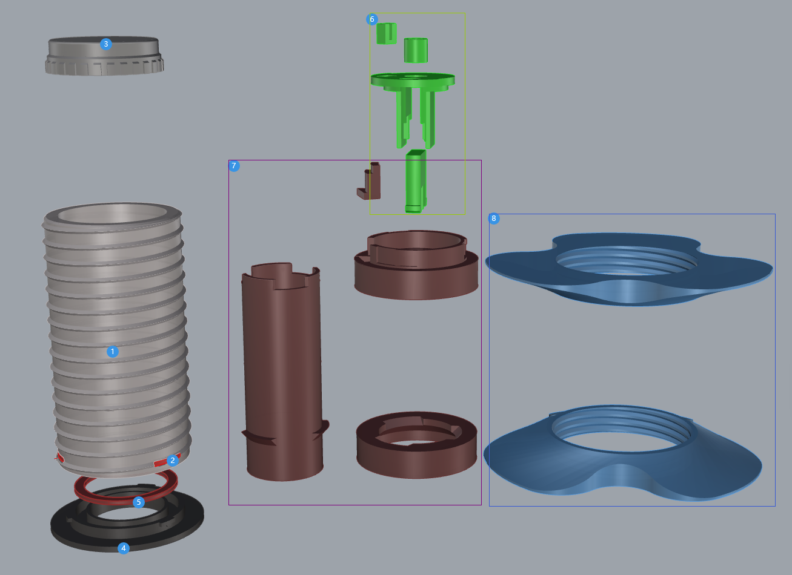
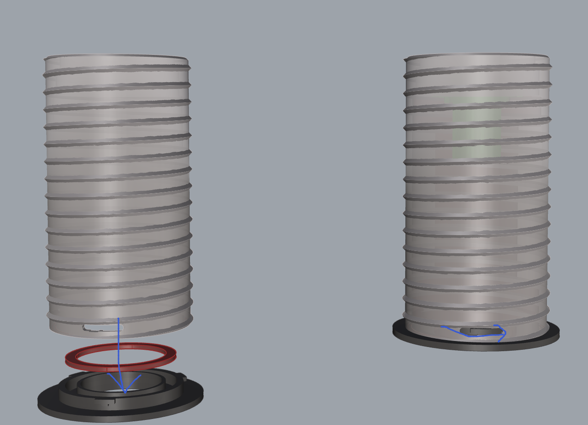

# User Guide

Welcome to this guide! This user manual provides you with detailed steps and precautions to help you perform various tasks smoothly.

## Table of Contents

- [User Guide](#user-guide)
  - [Table of Contents](#table-of-contents)
  - [1. Part Assembly with Glue](#1-part-assembly-with-glue)
    - [1.1 Potential Parts and Glue Application Positions](#11-potential-parts-and-glue-application-positions)
      - [1.1.1 Main Claw Seat](#111-main-claw-seat)
      - [1.1.2 Green Core](#112-green-core)
      - [1.1.3 Yellow Core](#113-yellow-core)
      - [1.1.4 Shaft](#114-shaft)
    - [1.2 Assembly Steps](#12-assembly-steps)
    - [1.3 Notes](#13-notes)
  - [2. Grease Application Positions](#2-grease-application-positions)
    - [2.1 Shaft](#21-shaft)
  - [3. Use of Torsion Spring Mould](#3-use-of-torsion-spring-mould)
  - [4. Rotary Spool Holder Installation](#4-rotary-spool-holder-installation)
    - [4.1 Bambu Version](#41-bambu-version)
      - [4.1.1 Prepared Printed Parts](#411-prepared-printed-parts)
      - [4.1.2 Prepared Hardware](#412-prepared-hardware)
      - [4.1.3 Installation Steps](#413-installation-steps)
    - [4.2 Universal Version](#42-universal-version)
      - [4.2.1 Prepared Printed Parts](#421-prepared-printed-parts)
      - [4.2.2 Prepared Hardware](#422-prepared-hardware)
      - [4.2.3 Installation Steps](#423-installation-steps)
  - [Feedback and Issue Reporting](#feedback-and-issue-reporting)

## 1. Part Assembly with Glue

### 1.1 Potential Parts and Glue Application Positions

When printing in parts and assembling, certain areas require glue to ensure firm adhesion. Refer to the following sections to understand the glue application positions for each part.

*The red areas on the images indicate where the glue should be applied.*

#### 1.1.1 Main Claw Seat

- **Base and Clip:** Apply glue to the contact surface between the base and the clip of the main claw seat to ensure a strong bond.

#### 1.1.2 Green Core

- **Claw Holder Components:** Apply glue to the claw holder components of the green core to ensure they are securely fixed.
- **Torsion Spring Center Fixation:** Apply glue to the contact area between the torsion spring center and the core to ensure the torsion spring is firmly attached.
- **Torsion Spring Short End Fixation:** Apply glue to the contact area between the short end of the torsion spring and the core to ensure secure fixation.

#### 1.1.3 Yellow Core

- **Claw Holder Components:** Apply glue to the claw holder components of the yellow core to ensure they are securely fixed.
- **Torsion Spring Center Fixation:** Apply glue to the contact area between the torsion spring center and the core to ensure the torsion spring is firmly fixed.
- **Torsion Spring Short End Fixation:** Apply glue to the contact area between the short end of the torsion spring and the core to ensure secure fixation.

#### 1.1.4 Shaft

- **Round Rod:** Apply glue to the contact points between the round rod of the shaft and other connecting components.
- **Top Spacer and Torsion Spring Long End Fixation:** Apply glue to the contact area between the top spacer and the long end of the torsion spring to ensure a stable connection.

### 1.2 Assembly Steps

1. **Choose the right glue:** Use strong glue suitable for plastic or 3D printed parts.
2. **Apply glue:** Evenly apply glue to the areas marked in the images above.
3. **Assemble parts:** Quickly align and press the parts with glue applied, ensuring each part fits tightly without gaps.
4. **Wait for the glue to cure:** Follow the instructions on the glue packaging and wait for the glue to cure to ensure firm adhesion.

### 1.3 Notes

- Do not apply too much glue to avoid overflow, which could affect appearance or cause weak adhesion.
- Use quick-drying glue to shorten the waiting time and improve assembly efficiency.
- Ensure all parts are completely cooled before assembling to ensure the glue is fully cured.
- Always work in a well-ventilated area to avoid inhaling glue fumes.
- Use protective gloves to avoid direct contact with glue, preventing allergies or skin irritation.
- Use protective mats or waste paper to prevent glue spills from dirtying the work surface or other parts.

## 2. Grease Application Positions

Proper lubrication helps ensure smooth operation of various parts, reducing friction and wear. Refer to the following sections to understand where grease should be applied:

- Apply grease to the contact areas between the core and the shaft to ensure smooth operation of the torsion spring.
- Apply a proper amount of grease to the two circular discs where the shaft contacts the shell to reduce friction.

*The blue areas in the images indicate where the grease should be applied.*

### 2.1 Shaft

The image below shows where grease needs to be applied to the shaft. Apply the grease evenly to reduce friction and ensure smooth rotation:

## 3. Use of Torsion Spring Mould

Creating torsion springs of suitable shapes can be aided by a torsion spring bending mould. Here are the steps for using the torsion spring bending mould:

1. The bending template is provided as a [3mf file](../3mf/torsion-spring-bending-template.3mf) in the warehouse. Print the corresponding disc based on the torsion spring direction.
2. Prepare the torsion spring to be bent, place it in the designated grooves of the mould.
3. Use appropriate tools to apply force, bending the wire beyond 90 degrees.
4. Cut off any excess wire.
5. Continue applying force until the wire is bent close to 180 degrees.
6. Remove the torsion spring from the mould and use pliers to adjust the spring shape.

## 4. Rotary Spool Holder Installation

### 4.1 Bambu Version

If printed in parts, assume the parts have already been glued together.

#### 4.1.1 Prepared Printed Parts

Numbers in the image:

1. Shell
2. Shaft
3. Green core (choose green or yellow according to your needs)
4. Shaft cover
5. Base
6. Gasket (default thickness 1.2mm, different thicknesses available)
7. Main claw seat (*3)
8. Main claw with secondary claw installation slot (*3)
9. Secondary main claw seat (0 / *3)
10. Secondary claw (0 / *3)

Secondary claw is optional, so the quantity is 0 or 3.

#### 4.1.2 Prepared Hardware

1. Bent torsion spring
2. Three-wave gasket M27*34mm

#### 4.1.3 Installation Steps

1. Assemble the claw seats and claws in the correct order and direction.
   1. The main claw seat has a small internal protrusion. Note the installation direction. Push the main claw into the claw seat. The provided clearance should allow the claw to be securely fixed in the seat. If there is any looseness, there are pre-drilled m1.6 screw holes in the model. You can use m1.6*5 countersunk screws for fixation.

      

   2. Push the secondary claw flat as shown in the image and pull it down.

      

2. Insert the green/yellow core into the shaft (apply lubricant to the corresponding position).
3. Fix the torsion spring (example with green core):

   

4. Install the shaft cover. Align the grooves, press the cover down, and rotate the cover to the right.

   

5. Insert the shaft into the shell (apply lubricant to the corresponding positions).
6. Place the spacer into the base and insert the three-peak washer.

   

7. Align the bottom groove of the shell with the protrusion on the base. Press the shell down and rotate it to the right.

   

8. Install the main claw in the corresponding large slot on the shell.

   

9. Install the secondary claw in the corresponding small slot on the shell (optional).

   

### 4.2 Universal Version

If printed in parts, assume the parts have already been glued together.

#### 4.2.1 Prepared Printed Parts

Numbers in the image:

1. Shell
2. Shell support (to be removed, remove it before installation)
3. Shaft cover
4. Base
5. Gasket (default thickness 1.2mm, different thicknesses available)
6. Green core (choose green or yellow according to your needs)
7. shaft
8. Spool locking nut (height 8mm, maximum outer diameter 80mm)

#### 4.2.2 Prepared Hardware

1. Bent torsion spring
2. Three-wave gasket M25*31mm

#### 4.2.3 Installation Steps

1. Insert the green/yellow core into the shaft (apply lubricant to the corresponding position).
2. Fix the torsion spring (example with green core):

   

3. Install the shaft cover. Align the grooves, press the cover down, and rotate the cover to the right.

   

4. Insert the shaft into the shell (apply lubricant to the corresponding positions).
5. Place the spacer into the base and insert the three-peak washer.

   

6. Align the bottom groove of the shell with the protrusion on the base. Press the shell down and rotate it to the right.

   

7. Rotate one spool locking nut onto the shell. After that, insert the spool and then rotate another spool locking nut. Pay attention to the taper direction. Lock it tight after inserting the spool.

   

## Feedback and Issue Reporting

If you encounter any problems during use or have any questions about the model, feel free to submit an [Issue](https://github.com/zjoycelee/amslite-rotary-spool/issues) on this project.