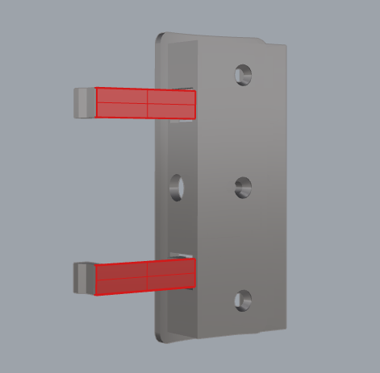
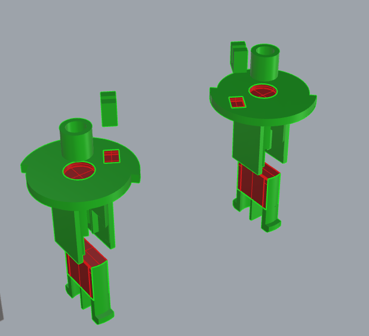

# User Guide

Welcome to this guide! This user manual provides you with detailed steps and precautions to help you perform various tasks smoothly.

## Table of Contents

- [User Guide](#user-guide)
  - [Table of Contents](#table-of-contents)
  - [1. Part Assembly with Glue](#1-part-assembly-with-glue)
    - [1.1 Possible Parts and Glue Application Locations](#11-possible-parts-and-glue-application-locations)
      - [1.1.1 Main Claw Seat](#111-main-claw-seat)
      - [1.1.2 Green Core](#112-green-core)
      - [1.1.3 Yellow Core](#113-yellow-core)
      - [1.1.4 Shaft](#114-shaft)
    - [1.2 Assembly Steps](#12-assembly-steps)
    - [1.3 Precautions](#13-precautions)
  - [2. Grease Application Locations](#2-grease-application-locations)
    - [2.1 Shaft](#21-shaft)
  - [3. Torsion Spring Template Usage](#3-torsion-spring-template-usage)
  - [4. Rotary Spool Installation](#4-rotary-spool-installation)
    - [4.1 Prepared Printed Parts](#41-prepared-printed-parts)
    - [4.2 Prepared Hardware Parts](#42-prepared-hardware-parts)
    - [4.3 Installation Steps](#43-installation-steps)
  - [Feedback and Issue Reporting](#feedback-and-issue-reporting)

## 1. Part Assembly with Glue

### 1.1 Possible Parts and Glue Application Locations

During the part printing and assembly process, some areas require glue to ensure a strong bond. Please refer to the sections below for glue application locations.

*The red areas in the images indicate where glue should be applied.*

#### 1.1.1 Main Claw Seat

- **Base and Clip:** Apply glue to the contact surface between the base and the clip of the main claw seat to ensure a strong bond.

#### 1.1.2 Green Core

- **Clip Parts:** Apply glue to the clip parts of the green core to secure them.
- **Torsion Spring Center Fixation:** Apply glue to the contact point between the torsion spring center and the core.
- **Torsion Spring Short End Fixation:** Apply glue to the contact point between the torsion spring short end and the core.

#### 1.1.3 Yellow Core

- **Clip Parts:** Apply glue to the clip parts of the yellow core to secure them.
- **Torsion Spring Center Fixation:** Apply glue to the contact point between the torsion spring center and the core.
- **Torsion Spring Short End Fixation:** Apply glue to the contact point between the torsion spring short end and the core.

#### 1.1.4 Shaft

- **Round Rod:** Apply glue to the contact points between the round rod of the shaft and other connecting parts.
- **Top Gasket and Torsion Spring Long End Fixation:** Apply glue to the contact points between the top gasket and the torsion spring long end.

### 1.2 Assembly Steps

1. **Choose the Right Glue:** Use strong adhesive suitable for plastic or 3D printed parts.
2. **Apply Glue:** Evenly apply glue to the areas indicated in the images above.
3. **Assemble Parts:** Quickly align and press the glued parts together to ensure tight contact without gaps.
4. **Wait for Glue to Cure:** Allow the glue to cure according to the instructions on the packaging to ensure a strong bond.

### 1.3 Precautions

- Do not apply too much glue to avoid overflow, which can affect the appearance or result in weak bonding.
- Use fast-drying glue to reduce waiting time and improve assembly efficiency.
- Ensure that all parts have fully cooled before assembly to guarantee proper curing of the glue.
- Always work in a well-ventilated area to avoid inhaling fumes from the glue.
- Wear protective gloves to avoid direct contact with glue and prevent allergic reactions or skin irritation.
- Use protective mats or scrap paper to prevent glue overflow from dirtying the work surface or other parts.

## 2. Grease Application Locations

Proper lubrication ensures smooth operation of the parts, reducing friction and wear. Refer to the following sections for the grease application locations:

- Apply grease to the contact points between the core and the shaft to ensure smooth operation of the torsion spring.
- Apply grease to the two circular pads where the shaft contacts the shell to reduce friction.

*The blue areas in the images indicate where grease should be applied.*

### 2.1 Shaft

The following image shows where grease should be applied to the shaft. Apply grease evenly to reduce friction and ensure smooth rotation:

## 3. Torsion Spring Template Usage

To create torsion springs of the correct shape, use the torsion spring bending template. Below are the steps for using the torsion spring bending template:

1. The bending template is available in the repo as a [3mf file](../3mf/torsion-spring-bending-template.3mf). Print the appropriate disc depending on the direction of the torsion spring.
2. Prepare the torsion spring that needs to be bent, placing it in the designated slot of the template.
3. Apply force with appropriate tools to bend the wire more than 90 degrees.
4. Cut off the excess wire.
5. Continue applying force to bend the wire to nearly 180 degrees.
6. Remove the torsion spring from the template and use pliers to adjust its shape.

## 4. Rotary Spool Installation

Assuming the printed parts have already been glued together as described in the part assembly section:

### 4.1 Prepared Printed Parts

The numbered parts in the image:

1. Shell
2. Shaft
3. Green Core (Choose either green or yellow based on your needs)
4. Shaft Cover
5. Base
6. Gasket (1.2mm thickness by default, with different thicknesses provided)
7. Main Claw Seat (*3)
8. Main Claw with Secondary Claw Slots (*3)
9. Secondary Claw Seat (0 / *3)
10. Secondary Claw (0 / *3)
Secondary claws are optional, so the quantity can be 0 or 3.

### 4.2 Prepared Hardware Parts

1. Bent Torsion Spring
2. Three-Wave Gasket

### 4.3 Installation Steps

1. Assemble the claw seat and claws in the correct order and orientation.
    1. The main claw seat has a small internal protrusion; install it with the correct orientation. Insert the main claw into the seat, ensuring a secure fit. If there is any looseness, use an M1.6*5 countersunk screw to fix it.

    

    2. Insert the secondary claw as shown in the image, sliding it horizontally first and then pulling it down.

    

2. Insert the green/yellow core into the shaft (apply grease to the contact points).
3. Secure the torsion spring, using the green core as an example:

    

4. Install the shaft cover, align the slots, and rotate the cover anticlockwise(face to cover) after pressing it down.

    

5. Insert the shaft into the shell (apply grease to the contact points).
6. Place the gasket into the base and add the three-wave gasket.

    

7. Align the shell’s bottom groove with the base protrusion, press the shell down, and rotate it anticlockwise(face to cover).

    

8. Install the main claw into the corresponding large slot on the shell.

    

9. Install the secondary claw into the corresponding small slot on the shell. (Optional)

    

## Feedback and Issue Reporting

If you encounter any issues or have questions about using the model, feel free to open an [Issue](https://github.com/zjoycelee/amslite-rotary-spool/issues) on GitHub.
