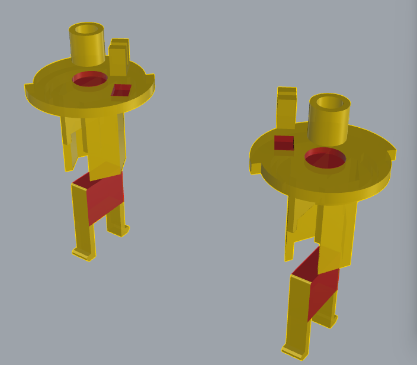
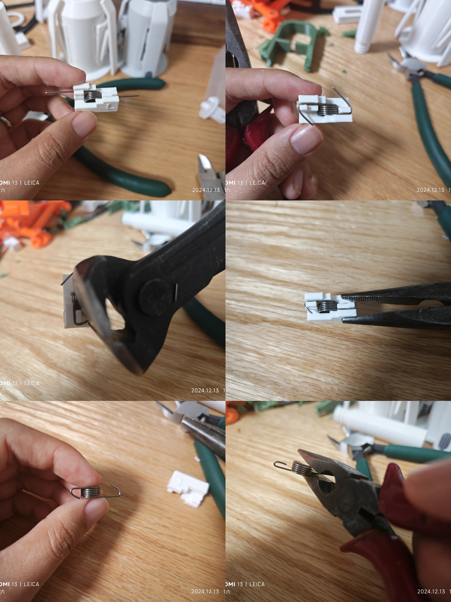
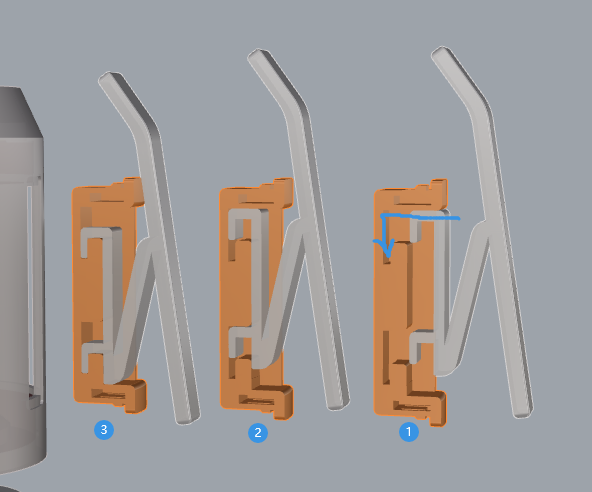
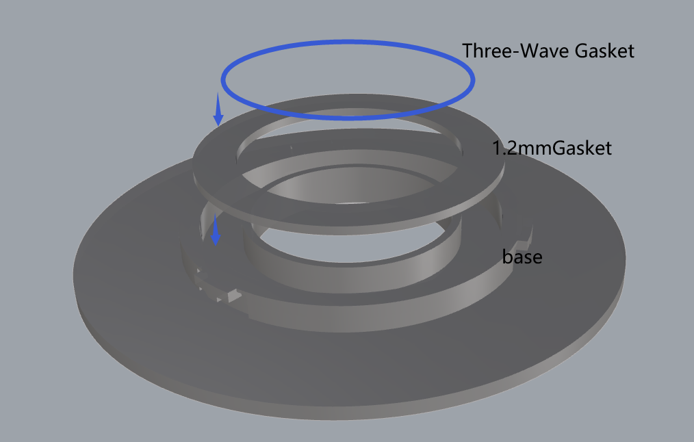
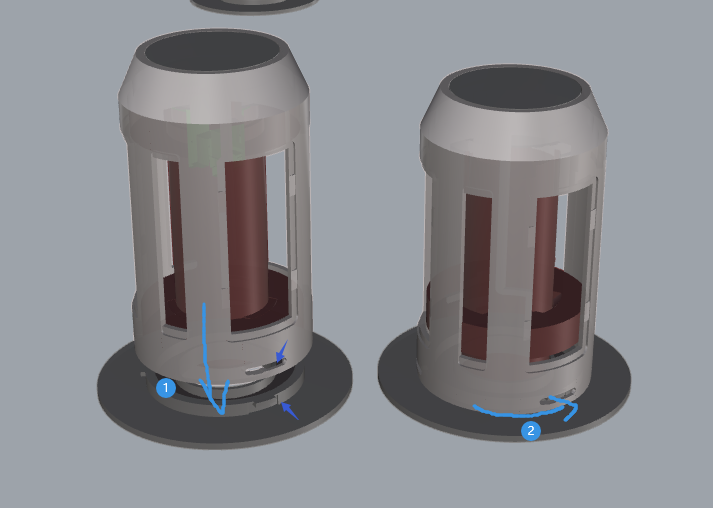
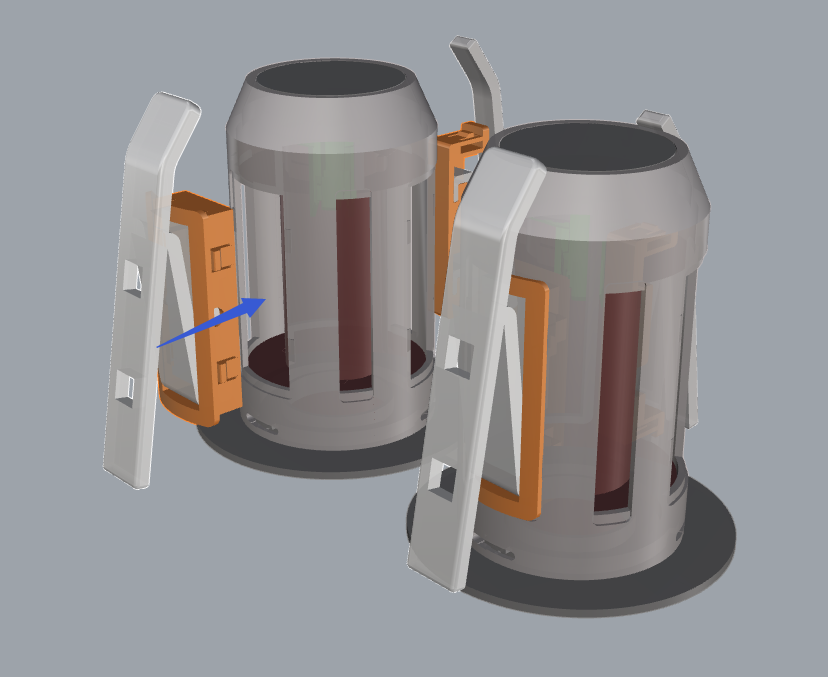

# 用户指南

欢迎使用本指南！本用户指南为您提供了详细的操作步骤和注意事项，帮助您顺利进行各类操作。

## 目录

- [用户指南](#用户指南)
  - [目录](#目录)
  - [1. 分件胶水组装](#1-分件胶水组装)
    - [1.1 有哪些可能的分件及胶水涂抹位置说明](#11-有哪些可能的分件及胶水涂抹位置说明)
      - [1.1.1 主爪座](#111-主爪座)
      - [1.1.2 绿色核心](#112-绿色核心)
      - [1.1.3 黄色核心](#113-黄色核心)
      - [1.1.4 中轴](#114-中轴)
    - [1.2 组装步骤](#12-组装步骤)
    - [1.3 注意事项](#13-注意事项)
  - [2. 润滑脂涂抹位置](#2-润滑脂涂抹位置)
    - [2.1 中轴](#21-中轴)
  - [3. 扭簧模具使用](#3-扭簧模具使用)
  - [4. 回转轴安装](#4-回转轴安装)
    - [4.1 拓竹风格版本](#41-拓竹风格版本)
      - [4.1.1 准备好的打印件](#411-准备好的打印件)
      - [4.1.2 准备好五金件](#412-准备好五金件)
      - [4.1.3 安装步骤](#413-安装步骤)
    - [4.2 通用版本](#42-通用版本)
      - [4.2.1 准备好的打印件](#421-准备好的打印件)
      - [4.2.2 准备好五金件](#422-准备好五金件)
      - [4.2.3 安装步骤](#423-安装步骤)
  - [反馈与问题报告](#反馈与问题报告)

## 1. 分件胶水组装

### 1.1 有哪些可能的分件及胶水涂抹位置说明

在分件打印并进行组装时，某些部位需要涂抹胶水以确保牢固的粘合。请参考以下部分了解分件的胶水涂抹位置。

*图中红色的部分是需要涂抹胶水的位置。*

#### 1.1.1 主爪座

- **底座和卡子:** 在主爪座的底座和卡子接触面涂抹胶水，确保这些部件牢固粘合。

#### 1.1.2 绿色核心

- **卡子部件:** 在绿色核心的卡子部分涂抹胶水，确保它们牢固固定。
- **扭簧中心固定:** 在扭簧中心和核心接触的地方涂抹胶水，确保扭簧牢固附着。
- **扭簧短端固定:** 在扭簧短端与核心接触的地方涂抹胶水，确保固定良好。

#### 1.1.3 黄色核心

- **卡子部件:** 在黄色核心的卡子部分涂抹胶水，确保它们牢固固定。
- **扭簧中心固定:** 在扭簧中心和核心接触的地方涂抹胶水，确保扭簧牢固固定。
- **扭簧短端固定:** 在扭簧短端与核心接触的地方涂抹胶水，确保固定牢固。

#### 1.1.4 中轴

- **圆形杆:** 在中轴圆形杆和其他连接部件的接触点涂抹胶水。
- **顶端垫片和扭簧长端固定:** 在顶端垫片和扭簧长端接触的地方涂抹胶水，确保连接稳固。

### 1.2 组装步骤

1. **选择合适的胶水:** 使用适用于塑料或3D打印部件的强力胶水。
2. **涂抹胶水:** 按照上述图片中标记的部位均匀涂抹胶水。
3. **组装部件:** 快速对齐并压紧胶水涂抹的部件，确保每个部件紧密结合，没有间隙。
4. **等待胶水固化:** 按照胶水包装上的说明，等待胶水固化，确保粘合牢固。

### 1.3 注意事项

- 确保不要涂抹过多的胶水，以免溢出，影响外观或导致粘合不牢。
- 使用快速固化胶水以缩短等待时间，提高组装效率。
- 确保所有部件完全冷却后再进行组装，以确保胶水充分固化。
- 始终在通风良好的区域工作，避免吸入胶水的气味。
- 使用防护手套，避免与胶水直接接触，防止过敏或皮肤刺激。
- 使用保护垫或废纸，防止胶水溢出弄脏工作表面或其他部件。

## 2. 润滑脂涂抹位置

适当的润滑有助于确保各部件的顺畅运作，减少摩擦和磨损。请参考以下部分了解润滑脂应该涂抹到哪些部位：

- 在核心和中轴的接触部位涂抹润滑脂，以确保扭簧运作时的平滑性。
- 在中轴与外壳接触的两个圆饼上涂抹适量润滑脂，减少摩擦力。

*图中蓝色的部分是需要涂抹润滑脂的位置。*

### 2.1 中轴

以下图示展示了在中轴部分需要涂抹润滑脂的位置，请均匀涂抹润滑脂，减少摩擦并确保平稳旋转：

## 3. 扭簧模具使用

制作合适形状的扭簧可以借助扭簧弯曲模具。以下是使用扭簧弯曲模具的步骤：

1. 仓库中提供了弯曲模板的 [3mf 文件](../3mf/torsion-spring-bending-template.3mf)，根据扭簧方向选择对应的盘进行打印。
2. 准备好需要弯曲的扭簧，将扭簧放入模具的指定槽位。
3. 使用适当工具施加力量，使铁丝弯曲超过90度。
4. 剪断多余的铁丝。
5. 继续施加力量，使铁丝弯曲接近180度。
6. 从模具上取下扭簧，用钳子调整扭簧形状。

## 4. 回转轴安装

### 4.1 拓竹风格版本

如果采用分件打印，假设打印件进行分件打印的部分已经用胶水组合完毕。

#### 4.1.1 准备好的打印件

图片中的标号：

1. 外壳
2. 中轴
3. 绿色核心（根据需求选择绿色或黄色）
4. 轴盖
5. 底座
6. 垫片（默认1.2mm厚度，提供不同厚度）
7. 主爪爪座（*3）
8. 主爪带副爪安装槽位（*3）
9. 副主爪座（0 / *3）
10. 副爪（0 / *3）

副爪为可选的，所以数量为0或3。

#### 4.1.2 准备好五金件

1. 弯曲好的扭簧
2. 三波峰垫片 M27*34mm

#### 4.1.3 安装步骤

1. 按照正确的顺序和方向组装爪座和爪。
   1. 主爪座有个内部小突起，注意安装方向，将主爪推入爪座中，预留的余量应该可以使爪在爪座中固定好，如果有松动，模型上预留了m1.6规格的螺丝孔，可以使用m1.6*5沉头螺丝固定。

      

   2. 副爪按图中平着推入后向下拉。

      

2. 将绿色/黄色核心放入中轴（对应位置涂抹润滑脂）。
3. 固定扭簧（以绿色为例）：

   

4. 安装轴盖，对准槽位，按下轴盖后向右旋转轴盖。

   

5. 将中轴装入外壳（对应位置涂抹润滑脂）。
6. 底座放入垫片，放入三波峰垫圈。

   

7. 将外壳底部凹槽与底座突起处对齐，按下外壳后向右旋转外壳。

   

8. 将主爪安装在外壳对应大槽位上。

   

9. 将副爪安装在外壳对应小槽位上（可选）。

   

### 4.2 通用版本

如果采用分件打印，假设打印件进行分件打印的部分已经用胶水组合完毕。

#### 4.2.1 准备好的打印件

图片中的标号：

1. 外壳
2. 外壳的支撑（需移除）
3. 轴盖
4. 底座
5. 垫片（默认1.2mm厚度，提供不同厚度）
6. 绿色核心（根据需求选择绿色或黄色）
7. 中轴
8. 料盘锁定螺母（高度8mm，最大外径80mm）

#### 4.2.2 准备好五金件

1. 弯曲好的扭簧
2. 三波峰垫片 M25*31mm

#### 4.2.3 安装步骤

1. 将绿色/黄色核心放入中轴（对应位置涂抹润滑脂）。
2. 固定扭簧（以绿色为例）：

   

3. 安装轴盖，对准槽位，按下轴盖后向右旋转轴盖。

   

4. 将中轴装入外壳（对应位置涂抹润滑脂）。
5. 底座放入垫片，放入三波峰垫圈。

   

6. 将外壳底部凹槽与底座突起处对齐，按下外壳后向右旋转外壳。

   

7. 将一枚料盘螺母旋转到外壳上，后续装入料盘后再装入另一枚料盘螺母，注意锥度方向，装入料盘后记得锁紧。

   

## 反馈与问题报告

如果在使用过程中遇到任何问题，或者对模型的使用有疑问，欢迎在本项目提 [Issue](https://github.com/zjoycelee/amslite-rotary-spool/issues) 进行反馈。