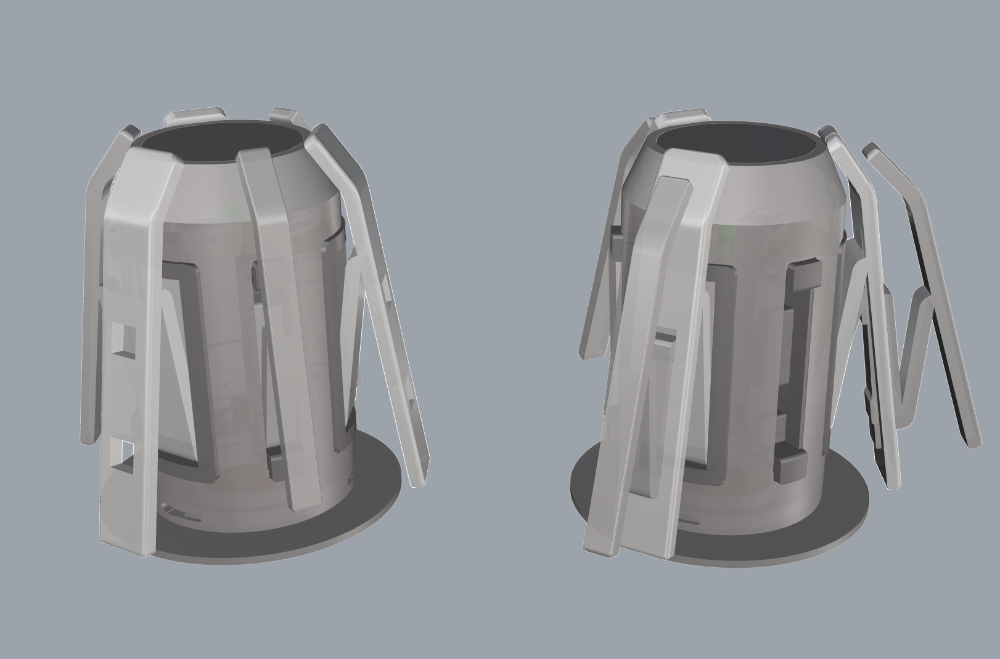
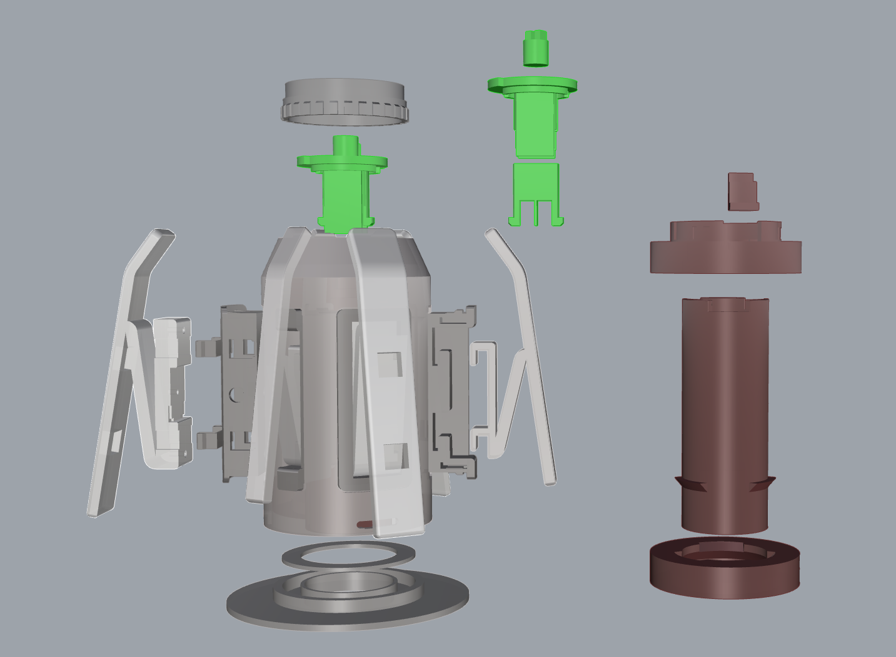
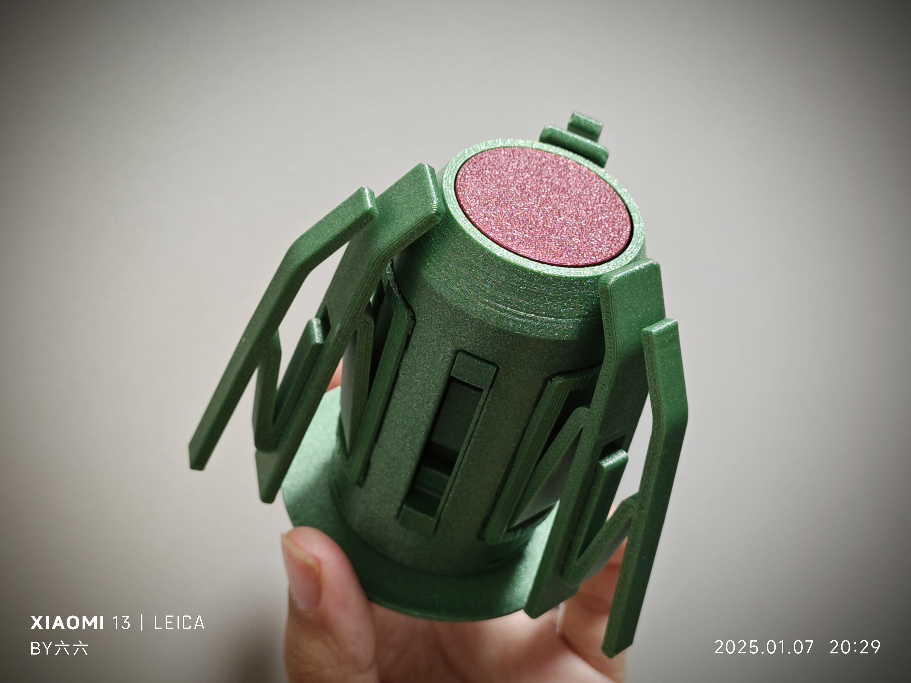
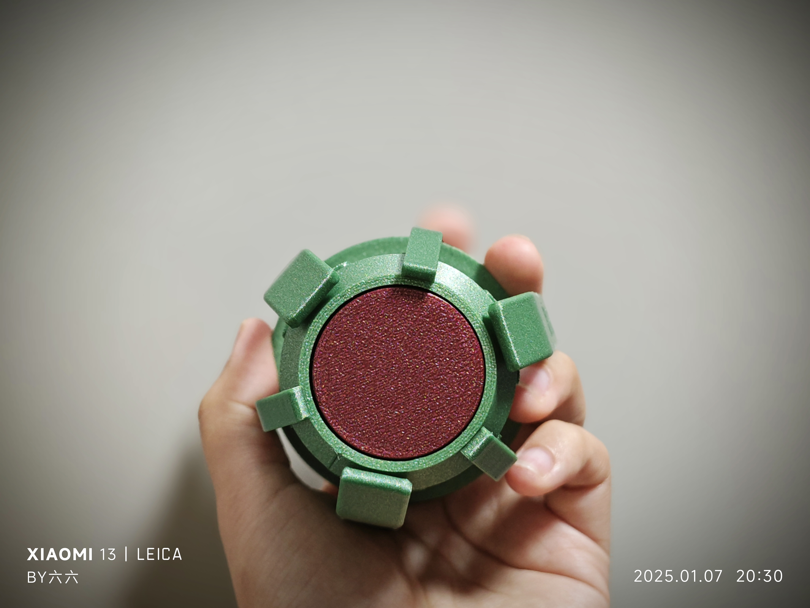
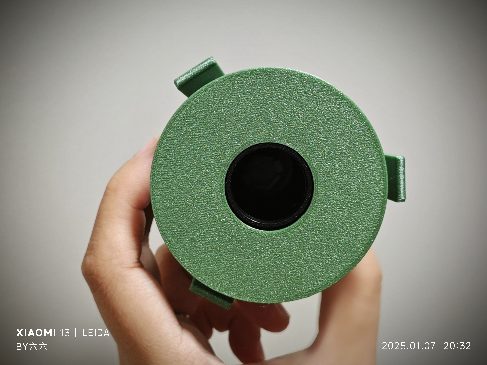

# AMS Lite Rotary Spool with Secondary Claws

This project provides a 3D printable rotary spool with an optional secondary claw setup for 3D printers. The rotary spool helps in maintaining the filament tension during printing, reducing the likelihood of tangled filament and print failure.

## Features & Advantages

1. **Easy to Print & Print Optimized**: The design is optimized for easy printing, the split makes it easy to print, reduces the need for the support structure, and the part that needs to be strengthened in the Z-axis direction is splited, and the printing direction can be changed to obtain better strength.
2. **Secondary Claw System**: The design includes a flexible secondary claw system that can be easily adapted to support filament rolls with varying core hole diameters, improving stability and reducing the risk of tangling. The secondary claws can be detached from the shell and assembled onto the main claw, allowing the spool to accommodate larger filament rolls with wider center holes (such as those from Jayo). This modular system ensures greater stability and minimizes the likelihood of filament tangling, making it versatile for different spool sizes.
3. **Cost-Effective**: The design is cost-efficient, requiring only 92g of filament material. The hardware cost is less than 1 RMB, making it an affordable option.
4. **Replaceable Parts**: Except for the claws, all other parts of the model are designed to replace the original versions, providing flexibility for upgrades and customization.

## Preview - Rotary Spool with Secondary Claws

Here are some shaded view images of the rotary spool with secondary claws:

- **Original and Combined Form**
  
  

- **Exploded Assembly View**
  
  

- **Real Shots**
  
  
  
  
  

## Required Hardware

This model requires two hardware components to function properly:

1. **Three-Wave Gasket**  
   - **Dimensions**: 27mm x 34mm x 0.4mm
   - **Height**: 3.1mm  
   - 

2. **Torsion Spring**  
   - **Wire Diameter**: 0.8mm  
   - **Outer Diameter**: 9mm  
   - **Rotation**: 180-degree left-hand/right-hand twist  
   - 
  

## Folder Structure

- **assets/**: Contains snapshots, real photos, and hardware component images.
  - **shaded-view-rotary-spool-with-secondary(original2combined).png**: Image showing both original and combined forms of the spool.
  - **shaded-view-rotary-spool-with-secondary-combined-form.png**: Combined form image of the rotary spool with secondary claws.
  - **shaded-view-rotary-spool-with-secondary-explode-form.png**: Exploded assembly view of the rotary spool with secondary claws.
  - **shaded-view-rotary-spool-with-secondary-original-form.png**: Original form image of the rotary spool with secondary claws.
  - **torsion_spring.jpg**: Photo of the torsion spring.
  - **waveform_gasket.jpg**: Photo of the Three-Wave Gasket.

- **3mf/**: Contains 3MF files for convenient printing.
  - **all-in-one.3mf**: 3MF file for the rotary spool, all in one plate. It includes both green and yellow core versions; uncheck one based on your preference.
  - **amslite-rotary-spool-with-secondary-claws.3mf**: 3MF file with secondary claws.
  - **test.3mf**: Test 3MF file for printing.

- **docs/**: Documentation files for usage instructions.
  - **user-guide.md**: A user guide for assembling and using the spool model.

- **stls/**: Contains 3D model files for printing.
  - **base.stl**: The base part of the spool assembly.
  - **shaft_cover.stl**: The cover for the shaft assembly.
  - **shell(thickened).stl**: The standard shell of the spool assembly.
  - **shell_with_secondary-claws(thickened).stl**: The shell with added slots for secondary claws.
  
  - **claw/**
    - **basic.stl**: The basic claw model (designed for the standard rotary spool, used for shell).
    - **main_claw_with_secondary_slots.stl**: Main claw with slots for secondary claws (designed for shell_with_secondary-claws).
    - **secondary_claw.stl**: Secondary claw model (designed for shell_with_secondary-claws, can be combined with the main claw for larger filament rolls).

  - **claw_seat/**
    - **main_claw_seat.stl**: The seat for the main claw.
    - **secondary_claw_seat.stl**: The seat for the secondary claw.
    - **main_claw_seat_pieces/**: Contains pieces for assembling the main claw seat.
      - **claw_seat_base.stl**: Base part for the claw seat.
      - **main_claw_seat_base.stl**: Main base part for the claw seat.
      - **main_claw_seat_clip.stl**: Clip for securing the claw seat.

  - **core_parts/**
    - **green_version.stl**: Core assembly parts for the green version (whole model, not split into pieces).
    - **yellow_version.stl**: Core assembly parts for the yellow version (whole model, not split into pieces).
    - **common_pieces/**: Shared parts between both versions of the core assembly.
      - **torsion_spring_center.stl**: Center part of the torsion spring.
      - **torsion_spring_short_end_clip.stl**: Short-end clip for the torsion spring.
    - **green_version_pieces/**: Parts specific to the green version.
      - **base-part.stl**: Base part of the green core.
      - **core_fixed_clip.stl**: Fixed clip for the green core.
    - **yellow_version_pieces/**: Parts specific to the yellow version.
      - **base-part.stl**: Base part of the yellow core.
      - **core_fixed_clip.stl**: Fixed clip for the yellow core.

  - **pressure_gaskets/**
    - **readme.md**: Instructions for using the pressure gaskets.
    - **thickness-0.2mm.stl** to **thickness-2.0mm.stl**: A selection of pressure gaskets with different thicknesses ranging from 0.2mm to 2.0mm.

  - **shaft/**
    - **shaft.stl**: Main shaft part for the assembly (whole model, not split into pieces).
    - **shaft_pieces/**: Contains pieces for assembling the shaft.
      - **bottom_disc_contact_waveform_gasket.stl**: Bottom disc in contact with the Three-Wave Gasket.
      - **round_shaft_part.stl**: Round shaft piece.
      - **top_disc_contact_core.stl**: Top disc in contact with the core.
      - **torsion_spring_long_end_clip.stl**: Long-end clip for the torsion spring.

  - **torsion_spring_bending_template/**
    - **torsion_spring_bending_template_left.stl**: Template for bending the left-hand torsion spring.
    - **torsion_spring_bending_template_right.stl**: Template for bending the right-hand torsion spring.

## 3MF Files

To make printing easier, 3MF files have been provided for direct use with **Orca** or **Bambu Studio**:

- **all-in-one.3mf**: 3MF file for the ratory spool, all in one plate, include both green and yellow core, you should uncheck one according to yourself.

Simply open the 3MF files in **Orca** or **Bambu Studio**, and you'll be ready to print!

## Assembly Instructions

1. **Main Assembly**:
   - First, print the **base.stl**, **shaft_cover.stl**, and **shell_with_secondary-claws(thickened).stl** files. These parts are the foundation of the rotary spool. 
   - **Recommendation**: It is recommended to print **shell_with_secondary-claws(thickened).stl** because it includes all the functionality of **shell(thickened).stl**. If you wish to add the secondary claw system later, based on this shell, you only need to add the secondary claw seats and claws. If you don’t need the secondary claw system, simply use **shell_with_secondary-claws(thickened).stl** without the additional parts.

2. **Claw Assembly**:
   - The **basic.stl** is designed for the standard rotary spool and does not have the necessary slots for secondary claws. It should not be used if you want to add the secondary claw system.
   - The **main claws** should be printed using **main_claw_with_secondary_slots.stl** if you plan to use the secondary claws to support larger filament rolls with bigger center holes. This main claw has slots that can accommodate **secondary_claw.stl**.
   - The **secondary_claw.stl** can only be combined with **main_claw_with_secondary_slots.stl** or **secondary_claw_seat.stl**. These parts include the necessary slots to fit the secondary claws.
   - **Recommendation**: It is recommended to print **main_claw_with_secondary_slots.stl** because it includes all the functionality of **basic.stl**. If you wish to add the secondary claw system later, based on this claw, you don't need to reprint the main claw. If you don’t need the secondary claw system, simply use **main_claw_with_secondary_slots.stl** without the additional parts.

3. **Claw Seats**:
   - The main and secondary claw seats are printed using **main_claw_seat.stl** and **secondary_claw_seat.stl**, respectively.

4. **Core Parts**:
   - If you prefer to print the core as a single piece, use **green_version.stl** for the green version or **yellow_version.stl** for the yellow version.
   - If you prefer to print the core in separate parts and assemble them with glue, use the following, the advantage of printing separately is reduced support material and optimized strength.:
     - For the green version, print the parts from **green_version_pieces/** and **common_pieces/**.
     - For the yellow version, print the parts from **yellow_version_pieces/** and **common_pieces/**.
   - The **common_pieces/** folder contains parts that should be printed regardless of which version you choose (green or yellow), such as the torsion spring center and short-end clip.

5. **Pressure Gaskets**:
   - Select a suitable gasket thickness based on your assembly's needs, from **pressure_gaskets/**. 

6. **Shaft**:
   - The shaft assembly has two versions:
     - **One-piece version**: **shaft.stl** is the complete model for the shaft, which can be printed as a single piece.
     - **Separate pieces version**: If you prefer to print the shaft in parts and assemble them with glue, print the parts from the **shaft_pieces/** folder. The advantage of printing separately is reduced support material and optimized strength.

7. **Torsion Spring Bending**:
   - If you need to bend the torsion spring, use the **torsion_spring_bending_template_left.stl** or **torsion_spring_bending_template_right.stl** from the **torsion_spring_bending_template/** folder.

## Licensing

This project is licensed under the [Creative Commons Attribution 4.0 International License](https://creativecommons.org/licenses/by/4.0/).

## Notes

- Ensure you check the correct version (green or yellow) of the core parts for compatibility with your other components.
- The assembly may require a few additional tools such as screws or clips, which are not included in the 3D model files but are commonly available.

## Conclusion

The AMS Lite Rotary Spool with Secondary Claws provides an easy-to-print solution for managing filament spools, reducing print failures, and accommodating larger filament rolls.
