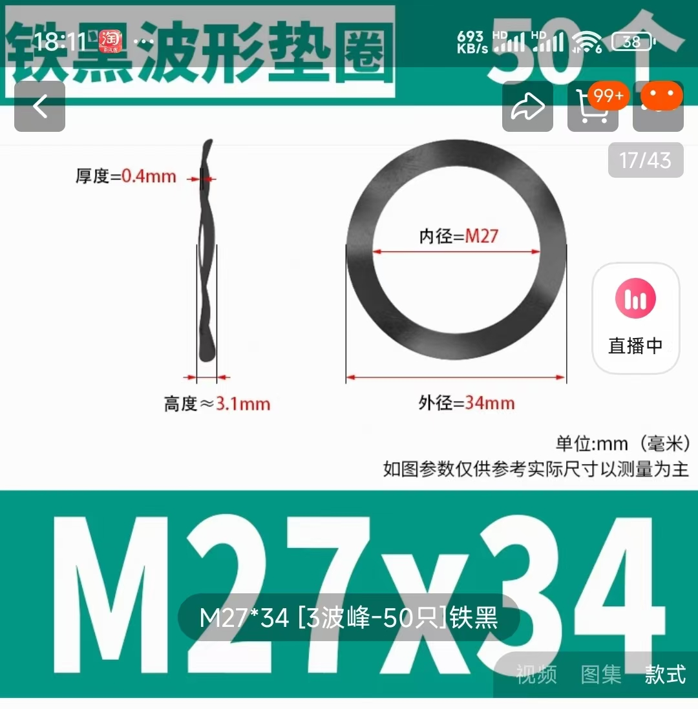

# Bambu Ratory Spool Replica

This project is a 3D model replica of the Bambu Ratory Spool, designed to replace most of the original parts. It requires two additional hardware components: a **Three-Wave Gasket** and a **Torsion Spring**. The project includes the 3D model files for printing, 3MF files for easy printing with Orca or Bambu Studio, and specifications for the hardware components.

## Purpose

The purpose of the **Ratory Spool** is to maintain tension on the filament during usage, reducing the possibility of tangling and lowering the risk of print failures.

The goal of the project is to **reduce costs**, as the official price for a single spool is 69 RMB.

## Project Advantages

- **Easy to Print**: The model has been optimized for 3D printing and strengthened for durability, making it easy to print with common 3D printers.
- **Low Cost**: The slicing requires only 82g of material, and the hardware costs are around 1 RMB (Chinese Yuan) for the required components.

## Folder Structure

- **assets/**: Contains snapshots, real photos, and hardware component images.
- **stls/**: Contains 3D model files for printing.
  - **torsion_spring_bending_templates/**: Folder containing templates for bending the torsion spring.
    - **torsion_spring_bending_template_left.stl**: Template for bending the left-hand torsion spring.
    - **torsion_spring_bending_template_right.stl**: Template for bending the right-hand torsion spring.
  - **core_parts/**: Folder containing the core parts, split into two versions (green and yellow).           # Print yellow/green according to your requirement
    - **green_version/**: Parts for the green version of the core assembly.
      - **body_part.stl**: Core body part (Green).
      - **core_fixed_clip.stl**: Core fixed clip (Green).
    - **yellow_version/**: Parts for the yellow version of the core assembly.
      - **body_part.stl**: Core body part (Yellow).
      - **core_fixed_clip.stl**: Core fixed clip (Yellow).
    - **common_parts/**: Parts for the yellow version of the core assembly.
      - **torsion_spring_center.stl**: Torsion spring center part (Common).
      - **torsion_spring_short_end_clip.stl**: Torsion spring short end fixed clip (Common).
  - **shaft_parts/**: Folder containing shaft parts, split into four parts for easier printing.
    - **round_shaft_part.stl**: Round shaft part.
    - **bottom_disc_contact_waveform_gasket.stl**: Bottom disc in contact with Three-Wave Gasket.
    - **top_disc_contact_core.stl**: Top disc in contact with the core.
    - **torsion_spring_long_end_clip.stl**: Torsion spring long end fixed clip.
  - **shaft_cover.stl**: The cover for the shaft assembly.
  - **base.stl**: The base of the spool assembly.
  - **pressure_gaskets/**: A selection of pressure adjustment gaskets with various thicknesses (0.2mm - 2.0mm).
  - **claw_seat/**: Folder containing the claw seat parts.
    - **claw_seat_complete/**: complete claw seat.
    - **claw_seat_base/**: body part.                                                     # Print 3 pcs
    - **claw_seat_clip/**: Clip, you should print two claw_seat_clip for one claw_seat.   # Print 6 pcs (2 clips per claw seat)
  - **claw**: Components for the final assembly of the claw.
    - **basic**: the shape of basic is similar with the origin one.                       # Print 3 pcs
  - **shell(thickened).stl**: The shell of the spool assembly.

- **3mf/**: Contains 3MF files for convenient printing.
  - **all-in-one**: 3MF file for the ratory spool, all in one plate, include both green and yellow core, you should uncheck one according to yourself.

- **docs/**: Documentation files for usage instructions.
  - **user_guide.md**: A user guide for assembling and using the spool model.

- **LICENSE**: The licensing terms for this project.

## Required Hardware

This model requires two hardware components to function properly:

1. **Three-Wave Gasket**  
   - **Dimensions**: 27mm x 34mm x 0.4mm
   - **Height**: 3.1mm  
   - 

2. **Torsion Spring**  
   - **Wire Diameter**: 0.8mm  
   - **Outer Diameter**: 9mm  
   - **Rotation**: 180-degree left-hand/right-hand twist  
   - 

## 3MF Files

To make printing easier, 3MF files have been provided for direct use with **Orca** or **Bambu Studio**:

- **all-in-one.3mf**: 3MF file for the ratory spool, all in one plate, include both green and yellow core, you should uncheck one according to yourself.

Simply open the 3MF files in **Orca** or **Bambu Studio**, and you'll be ready to print!

## Assembly Instructions

- Use the appropriate **torsion_spring_bending_template_left.stl** or **torsion_spring_bending_template_right.stl** to bend the torsion spring, depending on whether you need a left-hand or right-hand spring.
- Assemble the core parts using the appropriate versions (green or yellow) based on your preference.
- The shaft parts are split for easier printing, and the assembly requires gluing of parts where necessary.
- Select the appropriate pressure gasket for your assembly and install it accordingly.
