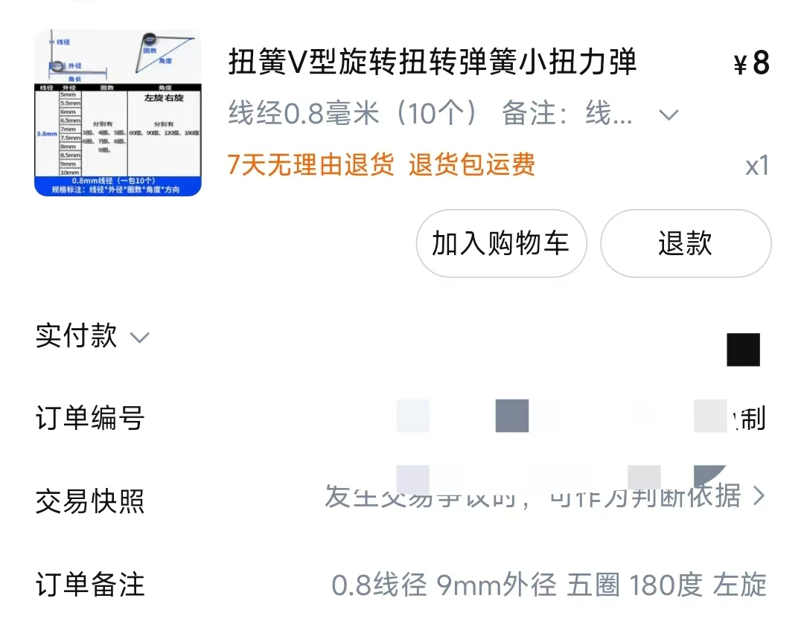
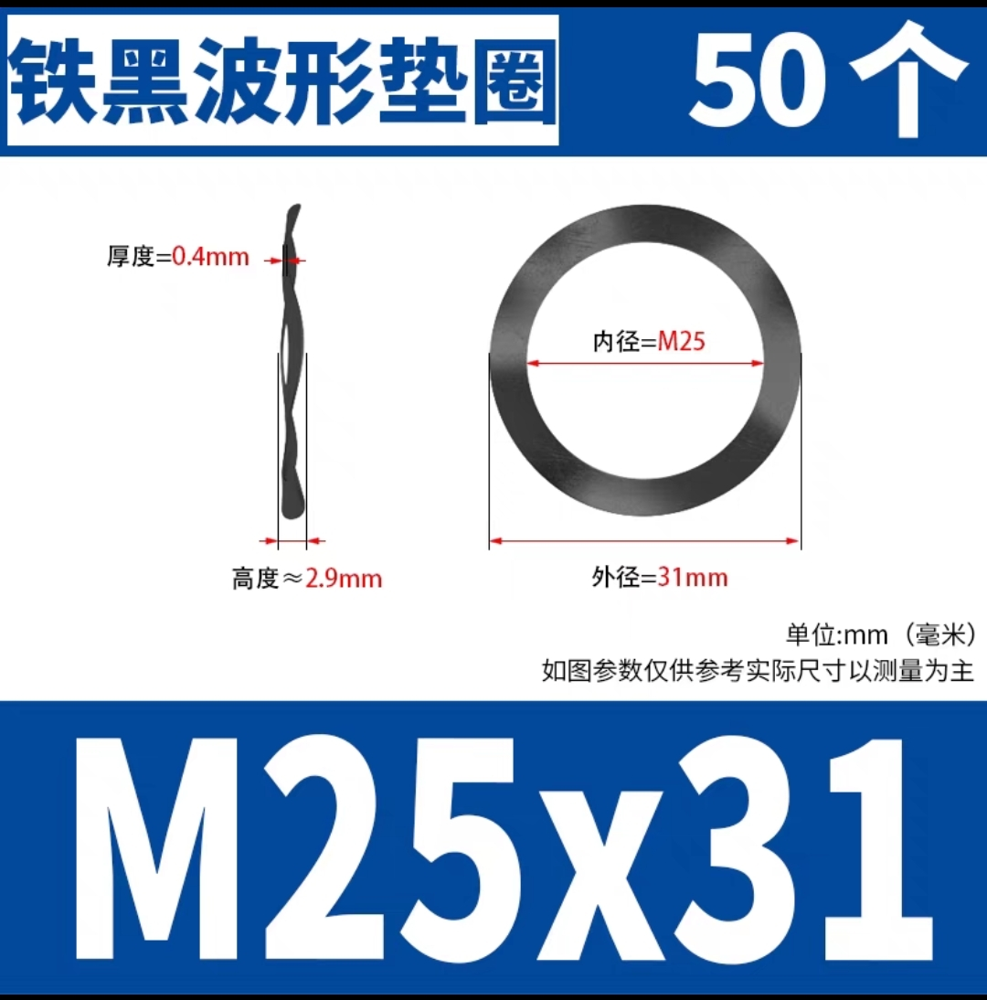
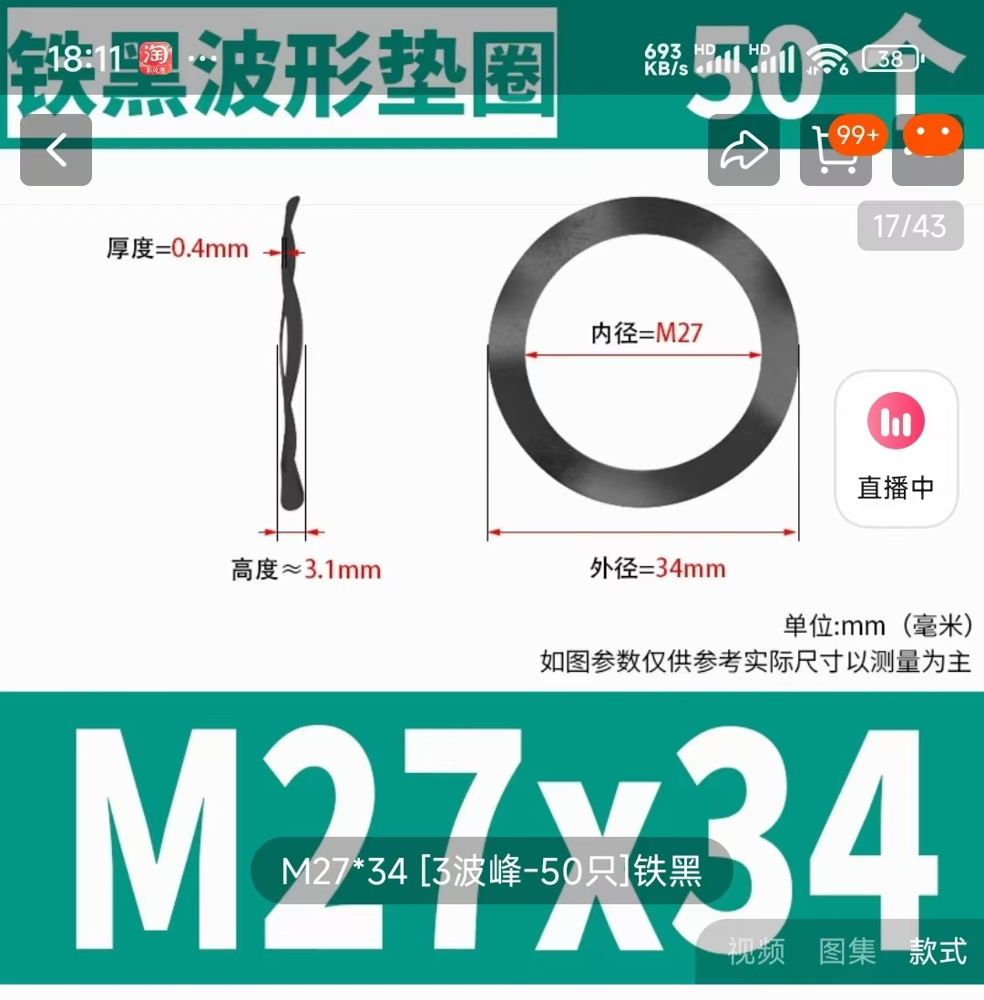

# AMSLite 回转轴

本项目提供了可 3D 打印的回转轴模型，包括两种版本：**拓竹风格**和**通用版本**。回转轴有助于保持打印过程中线材张力，减少缠绕，降低打印失败的风险。

## **特点与优势**

1. **易于打印 & 打印优化**  
   设计经过优化，部件拆分减少了对支撑结构的需求，并加强了 Z 轴方向的强度。改变打印方向可进一步优化强度。

2. **低成本**  
   通用版本仅需 59 克耗材，副爪版本仅需 92 克耗材，硬件成本不到 1 元人民币，非常经济实惠。

3. **料盘适用性广**  
   - **副爪系统**：设计包括灵活的副爪系统，可以适配不同的耗材轴心孔径，提高稳定性并减少缠绕风险。副爪可以从外壳上拆下并组装到主爪上，支持直径更大的料盘，尤其适用于孔径较大的料盘（例如 Jayo、Sunlu 品牌）。该系统的模块化设计确保了更高的稳定性，减少缠绕的可能性，适用于不同尺寸的耗材轴心。
   - **通用版本**：设计使螺杆直径尽可能小（比拓竹风格版本适用性更广，螺栓部位直径仅 40.69mm），例如 Sunlu 250g 料盘也能使用，原版 Amslite 无法适配。通用版本提供了更广泛的适用性，并且打印材料更少，速度更快。虽然换料需要拧螺母，但相比弹性爪系统的换料速度，通用版本不会出现塑料件疲劳且料盘锁紧后不会掉落。

4. **可替换部件**  
   除了爪部件，拓竹风格版本的其他所有部件均可作为原版备件使用，适用于替换损坏的部件。

## **所需硬件**

回转轴需要两个硬件组件才能正常工作：

1. **扭簧**  
   - **线径**: 0.8mm  
   - **外径**: 9mm  
   - **圈数**: 5  
   - **旋转方向**: 180度左旋/右旋  
   - 

2. **三波形垫片**  
   - **用于通用版本**  
     - **尺寸**: 25mm x 31mm x 0.4mm  
     - **高度**: 2.9mm  
     - 
   - **用于拓竹风格版本**  
     - **尺寸**: 27mm x 34mm x 0.4mm  
     - **高度**: 3.1mm  
     - 

## **项目文件夹结构**

- **assets/**：包含快照、真实照片和硬件组件的图片。
- **3mf/**：包含便于打印的 3MF 文件。
- **docs/**：使用说明文件。
- **stls/**：包含 3D 模型文件。
  - **xxx.stl**：一体化模型。
  - **xxx_pieces/**：拆分的模型部件。

## **3MF 文件**

为了简化打印过程，提供了 3MF 文件，所需模型文件、摆放方向以及支撑设置已在 3MF 文件中预设，经过我的测试，您可以直接在 **Orca** 或 **Bambu Studio** 中使用。

### 拓竹风格
- **all-in-one.3mf**: 包含回转轴（带副爪）的 3MF 文件，所有部件放置在同一盘中，包含绿色和黄色核心，根据需要选择一个。
- **amslite-rotary-spool-with-secondary-claws.3mf**: 包含回转轴（带副爪）的 3MF 文件，部件分布在三盘：第一盘包括底座、外壳、主爪座、主爪；第二盘包括中轴、轴盖、核心（绿色和黄色，选择其中一个）、1.2mm 垫片；第三盘包括副爪座、副爪。
- **others**: 五盘：第一盘包括所有 10 种规格的垫片，第二盘包括扭簧弯曲模板（包括左右两个版本），第三盘是一体化主爪座，第四盘是一体化核心（包括黄色和绿色），第五盘是一体化中轴。

### 通用版本
- **universal-amslite-rotary-spool-holder-with-auto-rewind**: 包含通用回转轴的 3MF 文件，所有需要的模型文件（底座、外壳、中轴、轴盖、核心、1.2mm 垫片、料盘螺母）都在其中。
- **universal-others**: 四盘：第一盘包括所有 10 种规格的垫片，第二盘包括扭簧弯曲模板（包括左右两个版本），第三盘是一体化核心（包括黄色和绿色），第四盘是一体化中轴。

### 其他
- **torsion-spring-bending-template.3mf**: 包含扭簧弯曲模板，第一盘用于左旋扭簧，第二盘用于右旋扭簧。
- **amslite-spool-holder-cap-with-number.3mf**: 包含四个带数字的中轴盖，分别为 1、2、3、4，可用于标识料盘。
- **ams-riser-v2-ams-lite-rotary-holder.3mf**: 适用于 Ams Riser v2 的回转轴固定座。
- **ams-riser-v2-ams-lite-rotary-holder-withAMS.3mf**: 适用于 Ams Riser v2 的回转轴固定座，逐件打印，不同颜色用于黄色和绿色插槽。

## **许可**

本项目采用 [Creative Commons Attribution 4.0 International License](https://creativecommons.org/licenses/by/4.0/)，欢迎修改和分发，但请注明出处。

## **免责声明**

请注意，回转轴和副爪系统的设计并不适用于承受极高负载或作为专业工具使用，仅适用于日常 3D 打印相关的线材管理。