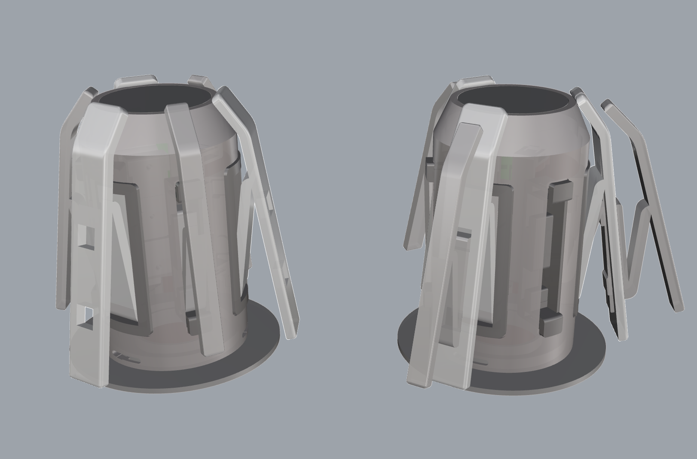

# AMSLite回转轴（带副爪系统）

这个项目提供了一个可打印的回转轴模型，并包含一个可选的副爪系统，适用于3D打印机。回转轴有助于保持打印过程中的线材张力，减少线材缠绕的可能性，从而降低打印失败的风险。

## 特点与优势

1. **易于打印 & 打印优化**: 该设计经过优化，拆件使得便于打印，减少了对支撑结构的需求，以及Z轴方向强度需要强化的部分做了拆件处理, 改变打印方向可以获得更好的强度。
2. **副爪系统**: 设计包括一个灵活的副爪系统，可根据不同的耗材轴心孔径进行适配，提高稳定性并减少缠线的风险。副爪可以从外壳上拆下并组装到主爪上，使得回转轴能够支持直径更大的料盘，尤其适用于孔径较大的料盘（例如Jayo品牌）。这种模块化系统确保了更高的稳定性，并最大限度地减少了缠线的可能性，适用于不同尺寸的耗材轴心。
3. **低成本**: 该设计非常具有成本效益，仅需92克耗材，硬件成本不到1元人民币，十分经济实惠。
4. **可替换部件**: 除了爪部件外，模型的其他部件均可替换原版，提供了灵活的升级和定制选项。

## 预览 - 带副爪的回转轴

这里是一些带辅爪系统回转轴的预览，包括形态的变化的着色图，以及实拍

- **原本形态以及组合形态**
  
  

- **分体图**
  
  

- **实拍图**
  
  
  
  
  

## 所需硬件

此模型需要两个硬件组件才能正常工作：

1. **三波形垫片**  
   - **尺寸**: 27mm x 34mm x 0.4mm  
   - **高度**: 3.1mm  
   - 

2. **扭簧**  
   - **线径**: 0.8mm  
   - **外径**: 9mm  
   - **旋转方向**: 180度左旋/右旋
   - 

## 文件夹结构

- **assets/**：包含快照、真实照片和硬件组件的图片。
  - **shaded-view-rotary-spool-with-secondary(original2combined).png**：展示原始形态和组合形态的图片。
  - **shaded-view-rotary-spool-with-secondary-combined-form.png**：带副爪的回转轴组合形态的图片。
  - **shaded-view-rotary-spool-with-secondary-explode-form.png**：带副爪的回转轴分体视图。
  - **shaded-view-rotary-spool-with-secondary-original-form.png**：带副爪的回转轴原始形态的图片。
  - **torsion_spring.jpg**：扭簧的照片。
  - **waveform_gasket.jpg**：三波形垫圈的照片。

- **3mf/**：包含便于打印的3MF文件。
  - **all-in-one.3mf**：包含绿色和黄色核心版本的3MF文件，选择性打印您偏好的版本。
  - **amslite-rotary-spool-with-secondary-claws.3mf**：包含副爪的3MF文件。
  - **test.3mf**：测试3MF文件。

- **docs/**：使用说明文件。
  - **user-guide.md**：回转轴模型的组装与使用指南。

- **stls/**：包含3D模型文件。
  - **base.stl**：回转轴基础部件。
  - **shaft_cover.stl**：中轴盖。
  - **shell(thickened).stl**：回转轴的标准外壳。
  - **shell_with_secondary-claws(thickened).stl**：带有副爪插槽的加厚外壳。

  - **claw/**
    - **basic.stl**：标准回转轴的基本爪（适用于标准外壳）。
    - **main_claw_with_secondary_slots.stl**：带副爪插槽的主爪（适用于带副爪插槽的外壳）。
    - **secondary_claw.stl**：副爪模型（适用于带副爪插槽的外壳，可以与主爪组合，适配更大直径的料盘）。

  - **claw_seat/**
    - **main_claw_seat.stl**：主爪座。
    - **secondary_claw_seat.stl**：副爪座。
    - **main_claw_seat_pieces/**：用于组装主爪座的部件。
      - **claw_seat_base.stl**：爪座底部部件。
      - **main_claw_seat_base.stl**：主爪座底部部件。
      - **main_claw_seat_clip.stl**：主爪座卡扣。

  - **core_parts/**
    - **green_version.stl**：绿色版本的核心部件（整体模型，无需拆分）。
    - **yellow_version.stl**：黄色版本的核心部件（整体模型，无需拆分）。
    - **common_pieces/**：绿色和黄色版本的共享部件。
      - **torsion_spring_center.stl**：扭簧中心部件。
      - **torsion_spring_short_end_clip.stl**：扭簧短端卡扣。
    - **green_version_pieces/**：绿色版本的专用部件。
      - **base-part.stl**：绿色核心的底部部件。
      - **core_fixed_clip.stl**：绿色核心的固定卡扣。
    - **yellow_version_pieces/**：黄色版本的专用部件。
      - **base-part.stl**：黄色核心的底部部件。
      - **core_fixed_clip.stl**：黄色核心的固定卡扣。

  - **pressure_gaskets/**
    - **readme.md**：压力垫圈使用说明。
    - **thickness-0.2mm.stl** 至 **thickness-2.0mm.stl**：不同厚度的压力垫圈，厚度范围从0.2mm到2.0mm。

  - **shaft/**
    - **shaft.stl**：回转轴主轴部件（整体模型，无需拆分）。
    - **shaft_pieces/**：用于组装主轴的部件。
      - **bottom_disc_contact_waveform_gasket.stl**：与三波形垫圈接触的底部圆盘。
      - **round_shaft_part.stl**：圆形主轴部件。
      - **top_disc_contact_core.stl**：与核心接触的顶部圆盘。
      - **torsion_spring_long_end_clip.stl**：扭簧长端卡扣。

  - **torsion_spring_bending_template/**
    - **torsion_spring_bending_template_left.stl**：左旋扭簧弯折模板。
    - **torsion_spring_bending_template_right.stl**：右旋扭簧弯折模板。

## 3MF 文件

为了简化打印过程，提供了3MF文件，您可以直接在 **Orca** 或 **Bambu Studio** 中使用：

- **all-in-one.3mf**: 包含回转轴的3MF文件，所有部件在一个平台上，包含绿色和黄色核心版本，您可以根据需要选择其中一个。

只需在 **Orca** 或 **Bambu Studio** 中打开这些3MF文件，即可开始打印！

## 组装说明

1. **主组件组装**：
   - 首先打印 **base.stl**、**shaft_cover.stl** 和 **shell_with_secondary-claws(thickened).stl** 文件。这些部件是回转轴的基础。
   - **推荐**：建议打印 **shell_with_secondary-claws(thickened).stl**，因为它包括了 **shell(thickened).stl** 的所有功能。如果您以后想要添加副爪系统，在此基础上，您只需添加副爪座和副爪。如果不需要副爪系统，只需使用 **shell_with_secondary-claws(thickened).stl** 即可，无需额外部件。

2. **爪部组件组装**：
   - **basic.stl** 适用于标准回转轴，不能与副爪系统配合使用，因为它没有副爪插槽。
   - 如果您计划使用副爪支撑更大直径的料盘，主爪应使用 **main_claw_with_secondary_slots.stl**，该主爪具有副爪插槽，可以与 **secondary_claw.stl** 配合使用。
   - **secondary_claw.stl** 只能与 **main_claw_with_secondary_slots.stl** 或 **secondary_claw_seat.stl** 配合使用，这些部件带有副爪插槽。
   - **推荐**：建议打印 **main_claw_with_secondary_slots.stl**，因为它包括了 **basic.stl** 的所有功能。如果以后需要副爪系统，只需在此基础上添加副爪，无需重新打印主爪。如果不需要副爪系统，只需使用 **main_claw_with_secondary_slots.stl** 即可，无需额外部件。

3. **爪座组装**：
   - 主爪座和副爪座分别使用 **main_claw_seat.stl** 和 **secondary_claw_seat.stl** 打印。

4. **核心部件**：
   - 如果您希望打印一体化的核心部件，请使用 **green_version.stl**（绿色版本）或 **yellow_version.stl**（黄色版本）。
   - 如果您希望将核心部件分开打印并使用胶水组装，请打印 **green_version_pieces/** 和 **common_pieces/**（绿色版本），或者 **yellow_version_pieces/** 和 **common_pieces/**（黄色版本）。分体打印的优势在于减少支撑材料和优化强度。
   - **common_pieces/** 文件夹包含两个版本核心部件都需要的共享部件，例如扭簧中心和短端卡扣。

5. **压力垫圈**：
   - 根据您的组装需求，从 **pressure_gaskets/** 中选择合适的垫圈厚度。

6. **中轴组件**：
   - 中轴组件有两种打印方式：
     - **一体化版本**：**shaft.stl** 是完整的中轴模型，作为单个部件打印。
     - **分体打印版本**：如果您希望将中轴分开打印并用胶水组装，请打印 **shaft_pieces/**

## 许可
本项目采用 [Creative Commons Attribution 4.0 International License](https://creativecommons.org/licenses/by/4.0/)，欢迎修改和分发，但请注明出处。

## 免责声明
请注意，回转轴和副爪系统设计并不适用于承受极高的负载或作为专业工具使用，仅适用于日常3D打印相关的线材管理。
